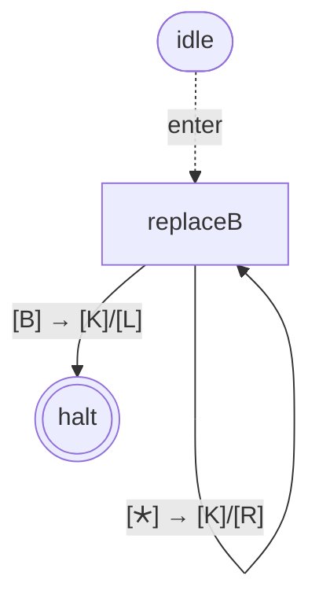

# turing-machine-js

[](https://github.com/mellonis/turing-machine-js/actions/workflows/main.yml)
[](https://coveralls.io/github/mellonis/turing-machine-js?branch=master)
[](https://github.com/users/mellonis/projects/5)

A composable Turing-machine engine for JavaScript, plus a declarative builder and binary-arithmetic libraries.

This repository contains the following packages:

* [@turing-machine-js/machine](https://github.com/mellonis/turing-machine-js/tree/master/packages/machine) — the core engine: `State`, `Tape`, `TapeBlock`, `TuringMachine`, plus `State.toGraph` / `State.fromGraph` and `toMermaid` / `fromMermaid` for visualization and round-trip.
* [@turing-machine-js/library-binary-numbers](https://github.com/mellonis/turing-machine-js/tree/master/packages/library-binary-numbers) — binary arithmetic on a 5-symbol alphabet (` ^$01`) supporting multiple numbers per tape, with `plusOne`, `minusOne`, `minusOneFast`, `invertNumber`, `normalizeNumber`, and inter-number navigation.
* [@turing-machine-js/library-binary-numbers-bare](https://github.com/mellonis/turing-machine-js/tree/master/packages/library-binary-numbers-bare) — the same arithmetic on a 3-symbol alphabet (` 01`), single-number-per-tape. Side-by-side with the marker-based library to make the alphabet-size vs state-graph-size trade-off visible.
* [@turing-machine-js/builder](https://github.com/mellonis/turing-machine-js/tree/master/packages/builder) — declarative state-table construction. Not actively developed; the same pattern is shown inline in `@turing-machine-js/machine`'s README.

# An example

A tape contains `a`, `b` and `c` symbols. The task is to replace every `b` with `*`.

```javascript
import {
  Alphabet,
  State,
  Tape,
  TapeBlock,
  TuringMachine,
  haltState,
  ifOtherSymbol,
  movements,
} from '@turing-machine-js/machine';

const alphabet = new Alphabet([' ', 'a', 'b', 'c', '*']);
const tape = new Tape({
  alphabet,
  symbols: ['a', 'b', 'c', 'b', 'a'],
});
const tapeBlock = TapeBlock.fromTapes([tape]);
const machine = new TuringMachine({
  tapeBlock,
});

console.log(tape.symbols.join('').trim()); // abcba

machine.run({
  initialState: new State({
    [tapeBlock.symbol(['b'])]: {
      command: [
        {
          symbol: '*',
          movement: movements.right,
        },
      ],
    },
    [tapeBlock.symbol([tape.alphabet.blankSymbol])]: {
      command: [
        {
          movement: movements.left,
        },
      ],
      nextState: haltState,
    },
    [ifOtherSymbol]: {
      command: [
        {
          movement: movements.right,
        },
      ],
    },
  }),
});

console.log(tape.symbols.join('').trim()); // a*c*a
```

## How it runs

Just one state — call it `replaceB` — that loops on every cell, writing `*` whenever the head reads `b` and stopping at the trailing blank. The engine emits its state graph via `toMermaid(toGraph(replaceB, tapeBlock))`:



Quick legend for the diagram above — full table at [packages/machine/README.md § Diagram conventions](packages/machine/README.md#diagram-conventions):

- **Edge format**: `[reads] → [writes]/[moves]` (each `[…]` is a tape-block reading; brackets always, even single-tape).
- **Read cells**: `'X'` (literal, single-quoted), `🞰` (`ifOtherSymbol` catch-all, U+1F7B0), `B` (the tape's blank).
- **Write cells**: `'X'` (literal), `K` (keep), `E` (erase = write blank).
- **Movement cells**: `L` / `R` / `S` (left / right / stay).
- **Node shapes**: `(((halt)))` = halt, `["square"]` = regular state, `[[double-walled]]` = wrapper-bare (subroutine shape), `idle([idle])` = pre-execution sentinel.
- **Edges**: `-->` regular, `==>` thick = transition into a wrapper (stack-push), `-. onHalt .->` = wrapper's catch-and-redirect, `-. enter .->` from `idle` = where execution starts.
- **Subgraph `w_N["halt frame"]`** wraps a `[[bare]]` + its halt marker — see [§Subroutine composition](packages/machine/README.md#subroutine-composition-with-withoverriddenhaltstate) in the engine README.

Trace on the input tape `abcba`:

| Step | State | Head reads | Write | Move | Goto | Tape after (head: `‹›`) |
|---|---|---|---|---|---|---|
| 1 | S | `a` | keep | R | S | `a‹b›cba` |
| 2 | S | `b` | `*` | R | S | `a*‹c›ba` |
| 3 | S | `c` | keep | R | S | `a*c‹b›a` |
| 4 | S | `b` | `*` | R | S | `a*c*‹a›` |
| 5 | S | `a` | keep | R | S | `a*c*a‹_›` |
| 6 | S | `_` | keep | L | halt | `a*c*‹a›_` |
