# `toMermaid` wrapped-state emit — design comparison

**Status:** decided — **Variant X with `subgraph` overlay + `idle` entry sentinel**. See [Final locked design](#final-locked-design-variant-x-with-subgraph-overlay) at the bottom for the exact diagrams and reader's contract. Each wrapper gets a `subgraph` rectangle labeled `"halt frame"` containing the `[[bare]]` (double-walled wrapper-node) and a cloned `(((halt)))`. The dotted `onHalt` edge originates from the `[[bare]]` and crosses the subgraph border to the override target. A stadium-shaped `idle([idle])` sentinel + labeled dotted arrow `idle -. enter .-> sN` is always emitted to mark the initial state — replaces the old `((round))` shape convention on non-wrapped initials, so the single canonical "start here" signal is the enter arrow. Decision rationale posted on [#138](https://github.com/mellonis/turing-machine-js/issues/138#issuecomment-4499377933). Implementation in PR [#169](https://github.com/mellonis/turing-machine-js/pull/169).

**Context.** [#138](https://github.com/mellonis/turing-machine-js/issues/138) — clean up the visually-confusing Mermaid output for `withOverriddenHaltState`-wrapped states. [#139](https://github.com/mellonis/turing-machine-js/issues/139) — bytewise round-trip regression for the wrapper name accumulation, naturally fixed by whichever design we pick.

Three live variants below — paste the fenced ` ```mermaid ` blocks into anything that renders Mermaid (GitHub preview, mermaid.live, IDE plugin).

---

## Baseline: current v7 emit

The shape we'd be replacing. Composite name flipped to paren form in [#168](https://github.com/mellonis/turing-machine-js/pull/168), still has all the readability problems #138 calls out: wrapper duplicates the bare's edges, dotted-edge attached to the wrong node visually, three non-halt nodes for what's conceptually a 2-step composition.

Single wrapper — `scanToX.withOverriddenHaltState(eraseHere)`:

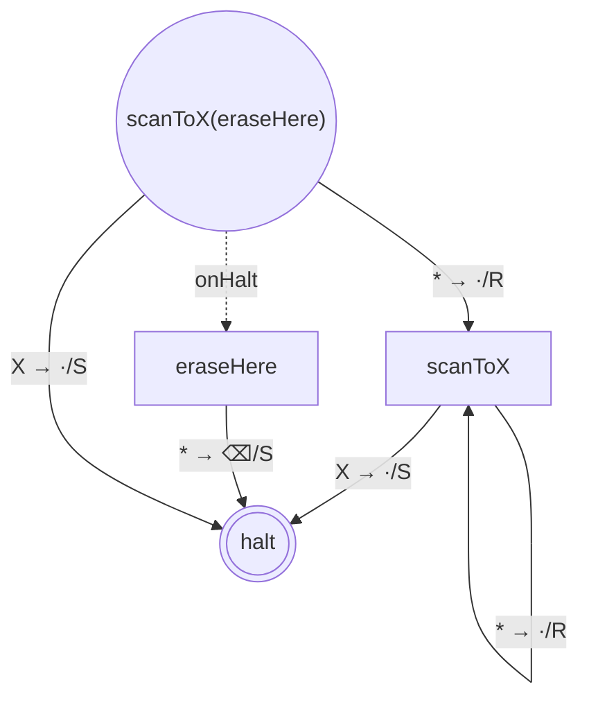

Nested — `A.withOverriddenHaltState(B.withOverriddenHaltState(C))` (placeholder transitions):

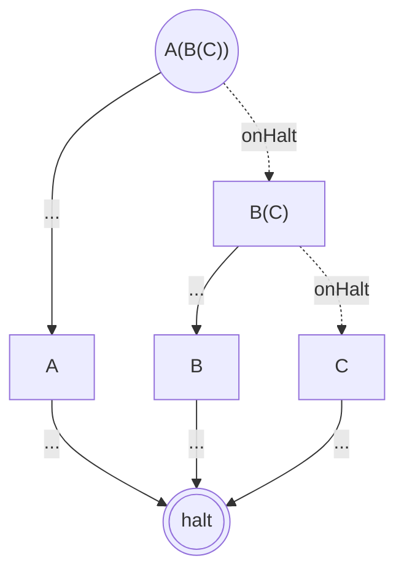

---

## Variant X — shape on the bare, no extra wrapper node

The wrapped state is signalled by **shape only**: `[[name]]` (subroutine, double-walled rectangle) on the bare. The wrapper node is not emitted at all — its identity collapses into the bare's. A dotted `onHalt` edge runs directly from the bare to the override target.

Single wrapper:

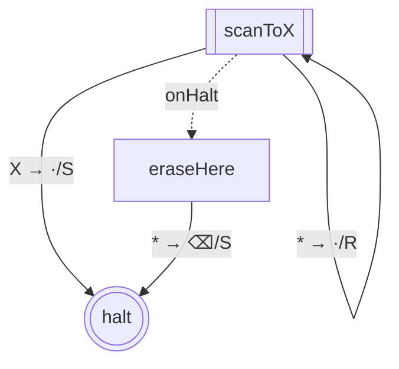

Nested — each wrapped state's bare gets `[[…]]`:

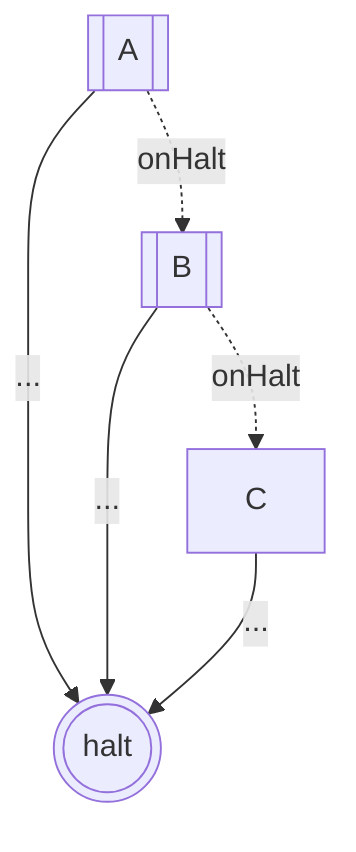

**Shared-bare case** — `minusOne` in `library-binary-numbers` is `invertNumber.with(plusOne.with(invertNumber.with(normalizeNumber)))`. The same `invertNumber` instance is the bare of two wrappers. In Variant X this is fine — `invertNumber` is one node, its `[[…]]` shape says "I'm wrapped in this context", and the dotted edge from it points at the relevant override:

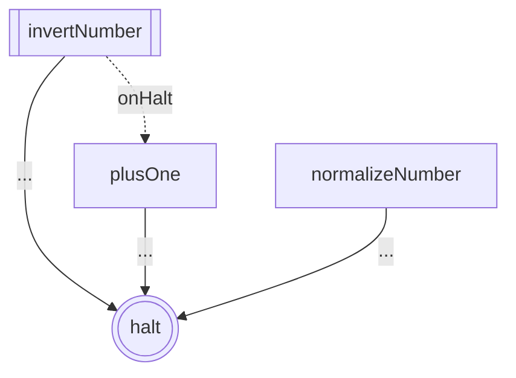

(Only the outermost wrapper is shown — `minusOne = invertNumber.with(W2)` — because that's what the caller passed to `toGraph`. Nested wrappers inside `W2` get their own `[[…]]` shapes and dotted edges as the walk descends.)

**Round-trip.** Graph carries only the bare's name; wrapper's composite name (`scanToX(eraseHere)`) does **not** appear in any graph node. `fromGraph` reconstructs via `bare.withOverriddenHaltState(override)` which recomputes the composite name fresh — no name accumulation, fixes [#139](https://github.com/mellonis/turing-machine-js/issues/139) automatically.

**Pros.** Minimal change. No extra nodes. Handles shared-bare cleanly (one node, one shape). Round-trip trivially stable.
**Cons.** Keeps the dotted-edge convention (some find it non-obvious). The wrapped-vs-not distinction lives in the node SHAPE rather than as a tangible halt-redirect joint.

---

## Variant Y₁ — pseudo-halt node per wrapper, with per-context duplication

The wrapper becomes a real node in the graph (sentinel label `~halt`, shape `[[…]]`). The bare's halt-bound transitions are **rewritten in the emit** to point at the pseudo-halt instead of at real halt. The pseudo-halt has a solid outgoing edge to the override. Most faithful to the runtime semantics — the wrapper IS the halt-redirect joint, and the graph makes that tangible.

Single wrapper:

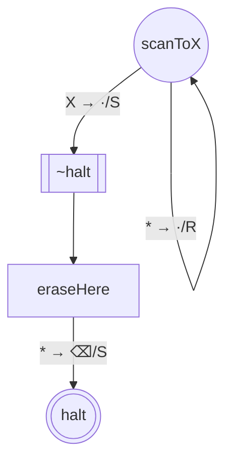

Nested:

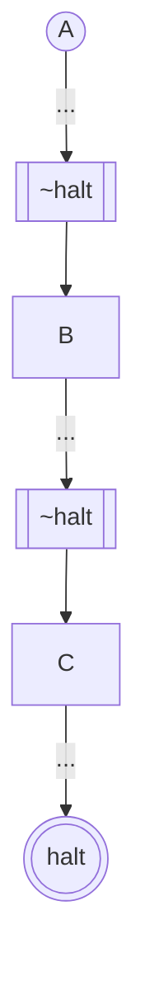

**Shared-bare case — the problem.** `minusOne` again: the same `invertNumber` instance is bare of W3 (outermost) and bare of W1 (innermost). In W3's wrapper context, its halt-bound transitions must rewrite to `ph_W3`; in W1's context, they must rewrite to `ph_W1`. Different rewrites in different contexts → **the state must be emitted twice as different nodes** (`s1` and `s4` below), or we lose the distinct halt-rewrite per wrapper.

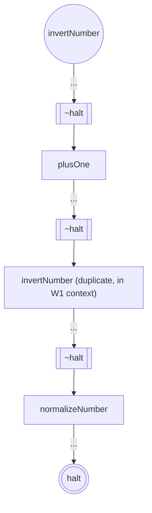

`fromGraph` needs to recognize the duplication and merge the two `invertNumber` copies back into one State instance at reconstruction. Possible but non-trivial.

**Pros.** Runtime-faithful — the wrapper appears as a concrete redirect step in the graph. No dotted-edge convention.
**Cons.** State duplication for shared-bare cases (common in the library). Significantly more parser + reconstruction logic in `fromMermaid` and `fromGraph` to handle duplication + merge. Strictly more nodes in the emit.

---

## Variant Y₂ — pseudo-halt as an additional node (no rewriting; keeps dotted edge)

A compromise: the pseudo-halt appears as a node with shape `[[~halt]]` and a **solid** outgoing edge to the override, but the bare's halt-bound transitions are **not** rewritten — they still point at real halt. The dotted `onHalt` edge runs from the bare to the pseudo-halt (replacing the current dotted-to-override edge). The pseudo-halt visualizes "the wrapper's redirect joint" without requiring per-context rewriting.

Single wrapper:

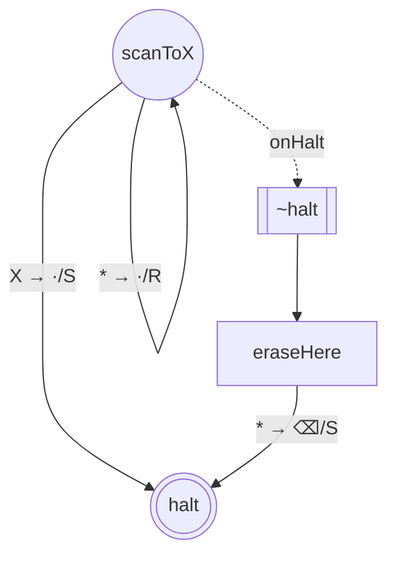

Nested:

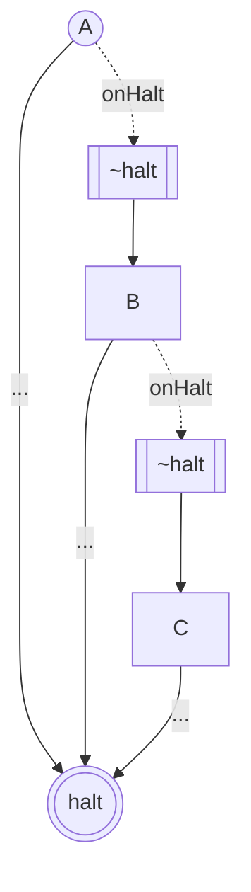

**Shared-bare case** — no duplication needed; `invertNumber` is one node, with one dotted `onHalt` edge to one pseudo-halt:

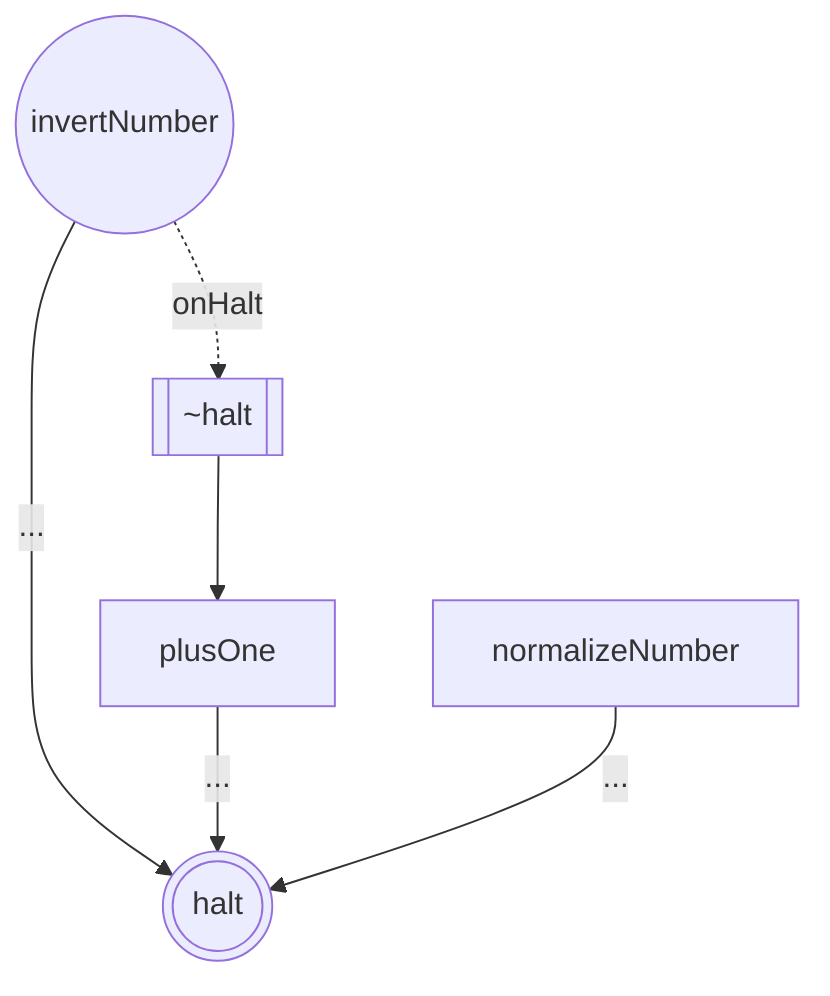

(Inner wrappers handled by recursion — each gets its own pseudo-halt node, dotted edge from its bare.)

**Pros.** Pseudo-halt visualized as a tangible step. No state duplication. Modest implementation cost.
**Cons.** Keeps the dotted-edge convention, just shifts what the dotted edge points at (bare → pseudo, instead of bare → override). One extra node per wrapper.

---

## Comparison table

| Concern | Baseline (current) | X (shape-on-bare) | Y₁ (rewriting pseudo) | Y₂ (additional pseudo) |
|---|---|---|---|---|
| Wrapper node duplicates bare's edges | ❌ yes | n/a (no wrapper node) | ✅ no | ✅ no |
| Dotted-edge convention | ✅ used | ✅ used (bare → override) | ❌ removed | ✅ used (bare → pseudo) |
| Extra nodes per wrapper level | 1 (wrapper) | 0 | 1 (pseudo) | 1 (pseudo) |
| Shared-bare handling | ✅ single node | ✅ single node | ❌ duplicate per context | ✅ single node |
| Round-trip stability ([#139](https://github.com/mellonis/turing-machine-js/issues/139)) | ❌ accumulates `(override)` | ✅ trivially stable | ✅ stable if dedup works | ✅ stable |
| Implementation surface | n/a | small | large (per-context walk, dedup) | medium |
| Faithfulness to runtime semantics | medium (composite name embedded) | medium (shape conveys it) | ✅ high (pseudo IS the joint) | medium-high (pseudo visible but no rewrite) |

---

## Recommendation

**Y₂ if you want the pseudo-halt visualized as a node**; **X if you want the smallest possible change.**

Y₁ is the most faithful but the cost of per-context state duplication in `fromGraph` is high for limited additional clarity over Y₂.

---

## Final locked design (Variant X with `subgraph` overlay)

After iteration, the locked shape evolves Variant X (collapse the wrapper into the bare's representation, no extra "wrapper node" in the graph data) with two visualization-only enhancements that make the wrapper's runtime semantics tangible without mutating the graph structure:

1. A Mermaid **`subgraph` rectangle labeled `"halt frame"`** around each wrapper — the visual scope for "the wrapper's stack frame for halt handling."
2. A **cloned `(((halt)))` node inside that subgraph** — visualization of "halt-bound transitions land here, *inside* the wrapper's scope." `haltState` is a runtime singleton; the cloned visual is a teaching aid (one halt-clone per wrapper context on the diagram, all corresponding to the single runtime instance).

### Visual contract (what a reader sees)

- **`subgraph wN["halt frame"]`** = wrapper's runtime stack frame. While execution is "inside" the rectangle, the wrapper's override target sits on the runtime stack waiting to catch a halt. Visual-only — does not mutate the graph's edges.
- **`[[bare]]`** (Mermaid subroutine / double-walled rectangle, "two lines on sides") = the wrapper-node. Both:
  - the wrapper's runtime entry point (execution starts here on entering the wrapper), and
  - the source of the dotted `onHalt` redirect (since the wrapper-node *is* the catcher).
- **Cloned `(((halt)))` inside the subgraph** = the halt entry point within this wrapper's scope. Halt-bound transitions from the bare terminate here, not at the real halt.
- **Solid arrows from `[[bare]]` to cloned halt** = the bare's structural halt-bound transitions. All stay inside the subgraph rectangle.
- **Dotted `onHalt` arrow from `[[bare]]` out of the subgraph to the override target** = the wrapper's catch-and-redirect. Exactly one per wrapper; the only arrow that crosses the rectangle border.
- **Real `(((halt)))` outside any subgraph** = the actual run terminus. Reached only by states that are *not* inside a wrapper's halt-frame (the unwrapped tail of the chain).

### Single wrapper

`scanToX.withOverriddenHaltState(eraseHere)`:

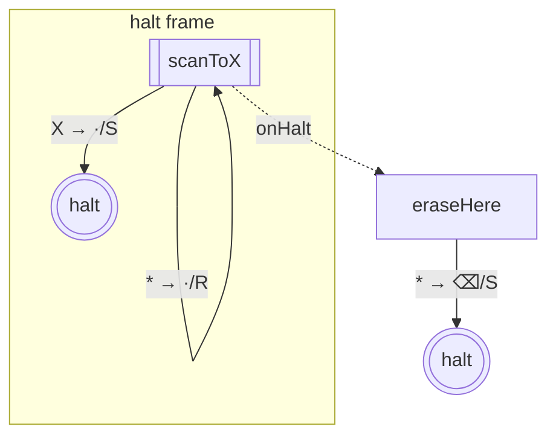

### Nested

`A.withOverriddenHaltState(B.withOverriddenHaltState(C))`:

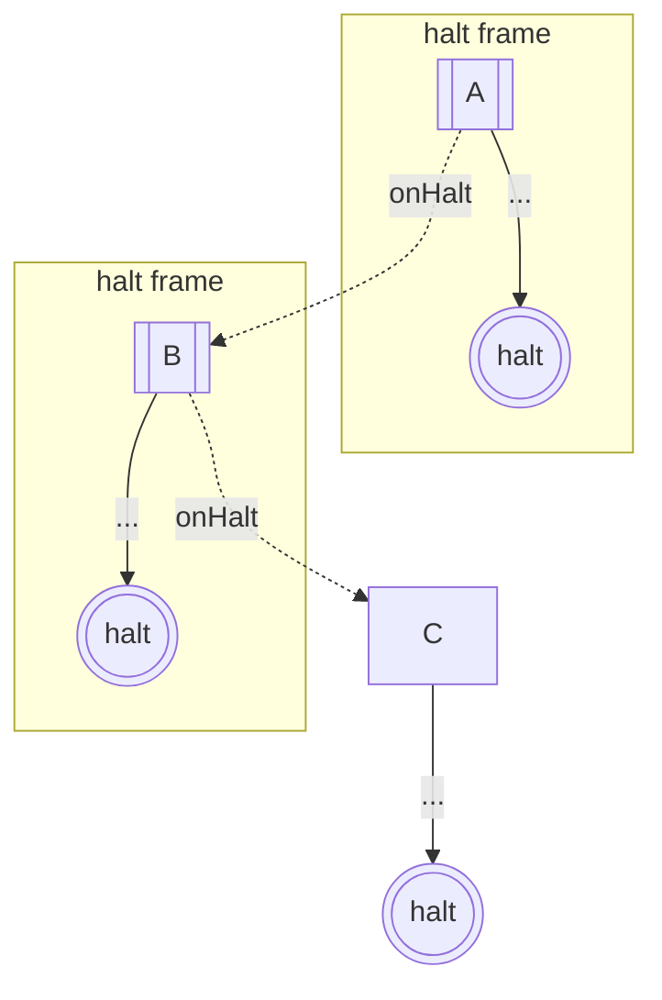

### Round-trip ([#139](https://github.com/mellonis/turing-machine-js/issues/139))

The wrapper's composite name (e.g. `scanToX(eraseHere)`) does **not** appear as any graph node's label — only the bare's name does. `fromGraph` reconstructs the wrapper via `bareStates[id].withOverriddenHaltState(getFinal(overriddenHaltStateId))`, which recomputes the composite name fresh on the reconstructed State instance. No round-trip name accumulation — fixes #139 automatically.

### Shared-bare handling

`library-binary-numbers`'s `minusOne` = `invertNumber.with(plusOne.with(invertNumber.with(normalizeNumber)))` — same `invertNumber` instance is the bare of two distinct wrappers (outermost and innermost). Each wrapper context implies its own `subgraph` membership + its own cloned halt + its own dotted `onHalt` edge.

Plan: emit the bare as a separate graph node per wrapper context (per-context duplication in `toGraph`). The shared State instance is preserved at runtime; the graph and Mermaid emit are per-context. `fromGraph` reconstructs equivalent State instances (not necessarily the same runtime `#id` as the original — just behaviorally equivalent).

### Implementation outline

1. Add `#bareState` field on `State`; populate in `withOverriddenHaltState` so `toGraph` can recover the bare from a wrapper instance.
2. `GraphNode` gains `isWrapped: boolean`.
3. `State.toGraph`:
   - Detect wrapper-States (those with `#overriddenHaltState !== null`).
   - Substitute with the bare; mark the bare's graph node `isWrapped: true`.
   - Synthesize a per-wrapper cloned-halt graph node (a node with `isHalt: true` whose role is "halt-clone for this wrapper").
   - Rewrite the bare's halt-bound transitions to target the cloned halt rather than the real one.
4. `toMermaid`:
   - `isWrapped: true` node → `s${id}[["${name}"]]` (subroutine shape).
   - Cloned-halt node → `s${id}(((halt)))` (triple-paren, identical to real halt).
   - Wrap each `[[bare]]` + its cloned halt in `subgraph wN["halt frame"] … end`.
   - Dotted onHalt edge `s${bareId} -. onHalt .-> s${overrideId}` (from `[[bare]]`, crossing the subgraph border).
5. `fromMermaid`:
   - Parse Mermaid `subgraph wN["..."] … end` blocks.
   - Recognize `s(\d+)\[\["([^"]*)"\]\]$` as wrapped-bare nodes; mark `isWrapped: true`.
   - Track subgraph membership for the round-trip.
6. `State.fromGraph`:
   - For `isWrapped: true` nodes, reconstruct via `bareStates[id].withOverriddenHaltState(getFinal(overriddenHaltStateId))`.
   - Cloned-halt graph nodes don't get separate State instances — they all map back to the singleton `haltState`.
7. `#139`'s round-trip test added; should pass after this design.
8. `states.md` regenerates with the new shape (both binary libraries).
9. README "Subroutine composition" section rewritten to use the new visual + reader's contract above.

### Downstream support (for `machines-demo` [#9](https://github.com/mellonis/machines-demo/issues/9) / [#10](https://github.com/mellonis/machines-demo/issues/10) / [#37](https://github.com/mellonis/machines-demo/issues/37))

Five design choices in #138's implementation that keep the demo's render + highlight + click-to-breakpoint features unblocked:

1. **Stable per-node ids in `Graph`.** Every node has a deterministic id:
   - Bare nodes: `node.id = bareState.id` (the engine's `State.#id`).
   - Cloned-halt nodes: synthesized but deterministic from `(bareNodeId, wrapper-depth)`.
   - Per-context bare duplicates: synthesized similarly.

   Mermaid emits `s${id}` for each; downstream can find the SVG node for any engine `state.id` directly.

2. **Cloned-halt marker on `GraphNode`.** `isClonedHalt: boolean` (additional to `isHalt: true`). Real halt has `isHalt: true, isClonedHalt: false`; cloned halts have both `true`. Downstream uses this to:
   - **#9** — emit cloned-halts with a different CSS class (`.cloned-halt` vs `.halt`) for styling.
   - **#10** — skip cloned-halts when computing "current state highlight" (they're visualization aids, not runtime states).
   - **#37** — skip cloned-halts when wiring click-to-toggle breakpoint handlers.

3. **Edge identity on `GraphTransition`.** Add `id: string` field, deterministic from `(fromNodeId, patternIndex)` where `patternIndex` is the index of that transition in the bare's symbol map. Mermaid emit injects the id via a CSS-class directive that downstream can target. This is what #10 needs to highlight "the edge that will fire next" precisely.

4. **Deterministic subgraph names in Mermaid emit.** Each wrapper's subgraph is `subgraph w_${bareNodeId}["halt frame"] … end`. Stable across rebuilds; downstream can target the rendered SVG group.

5. **`isWrapped: boolean` on `GraphNode`** (already in the locked design above) — gives [#37](https://github.com/mellonis/machines-demo/issues/37) the surface to know "this node is a wrapper, click sets a breakpoint that triggers when the wrapper would catch a halt."

**Out of scope for #138, deferred to #10 implementation:** exposing the runtime wrapper-context on `MachineState` (so downstream can disambiguate which duplicate-of-the-same-bare to highlight in shared-bare cases like `minusOne`). For the first cut of #10, lighting up all duplicates with the same `state.id` is acceptable; precision-tightening is a follow-up engine-API change. This is the only known shared-bare case in the library; user code rarely hits it.
