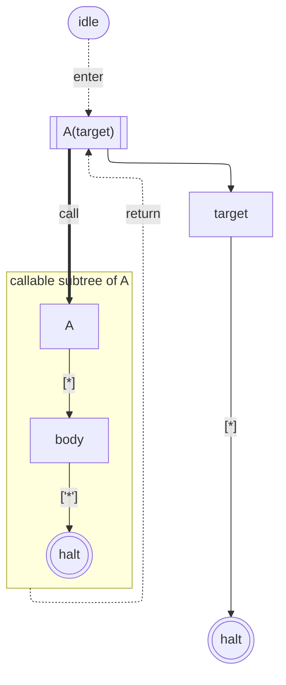
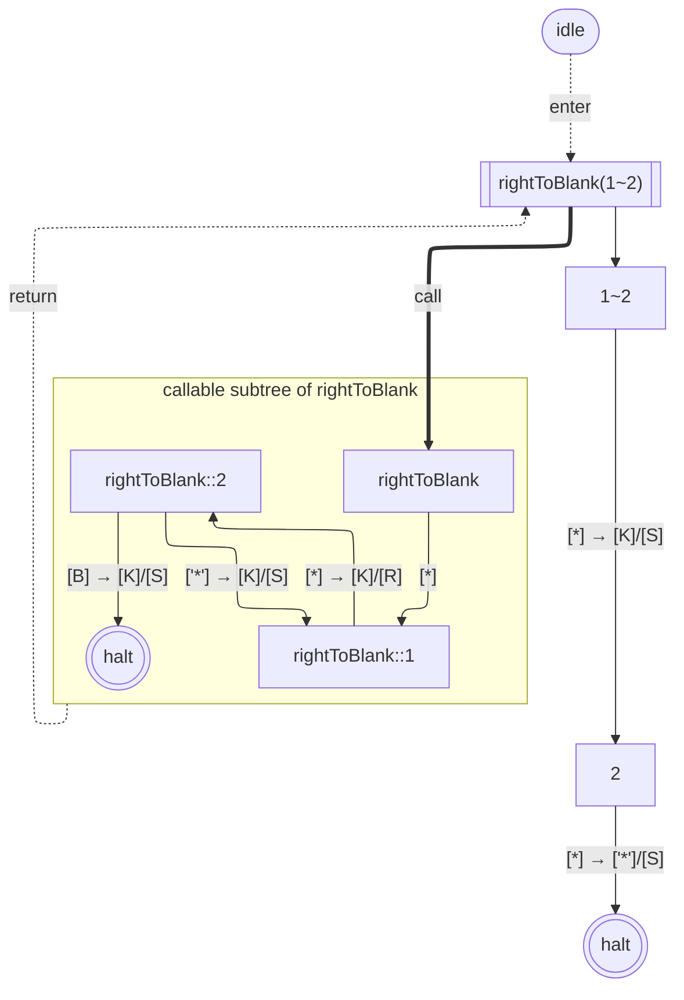
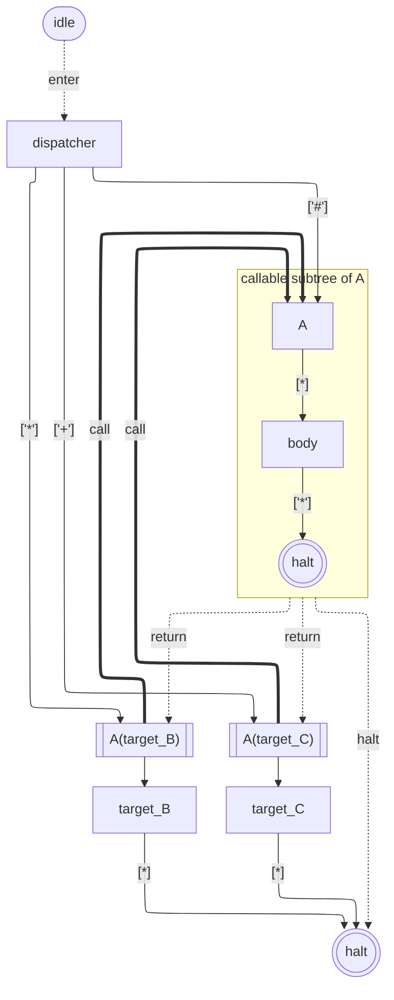
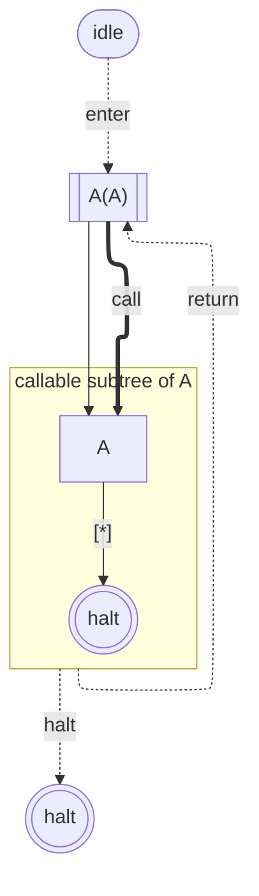
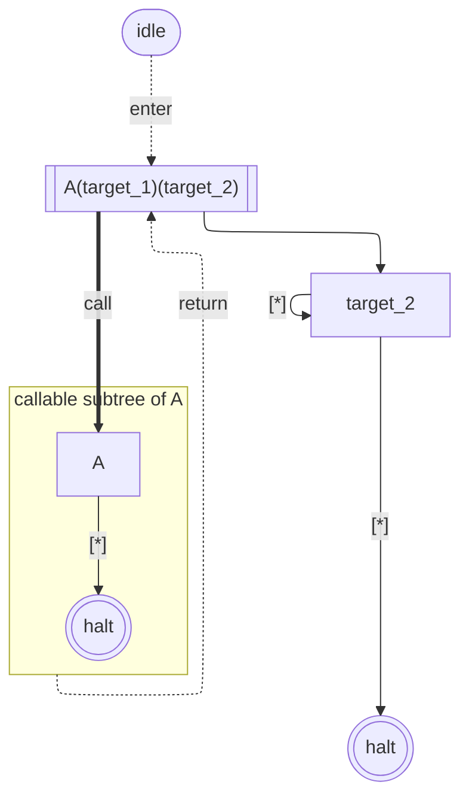
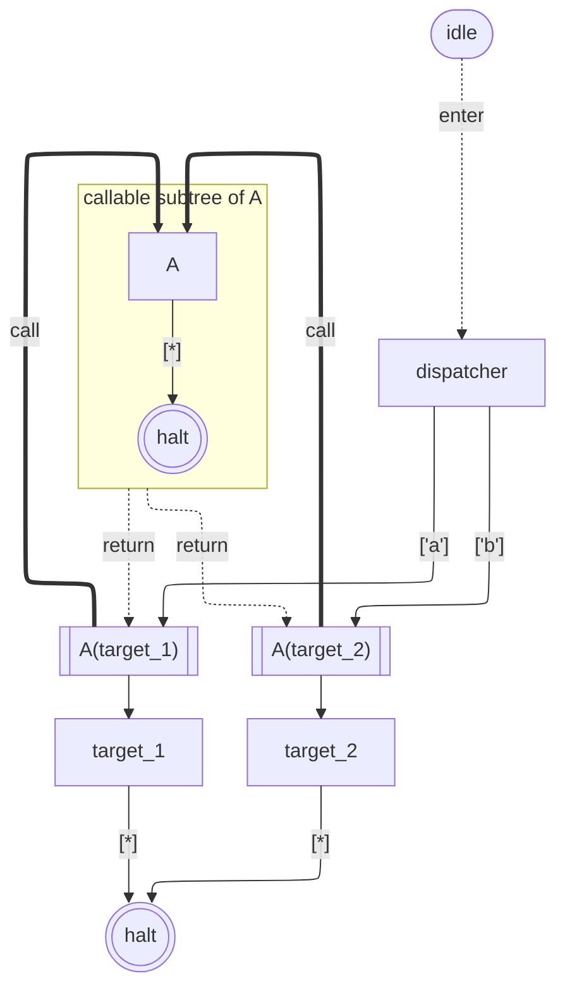
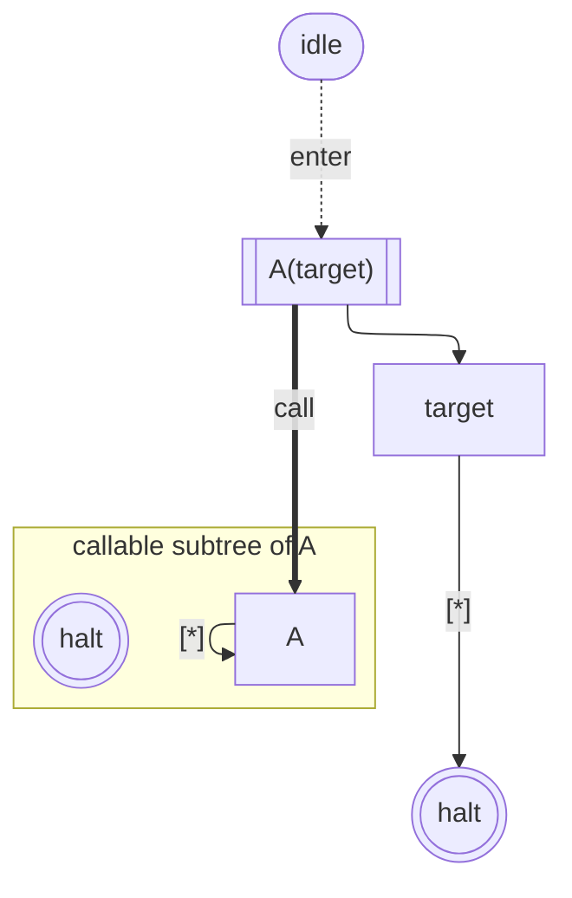
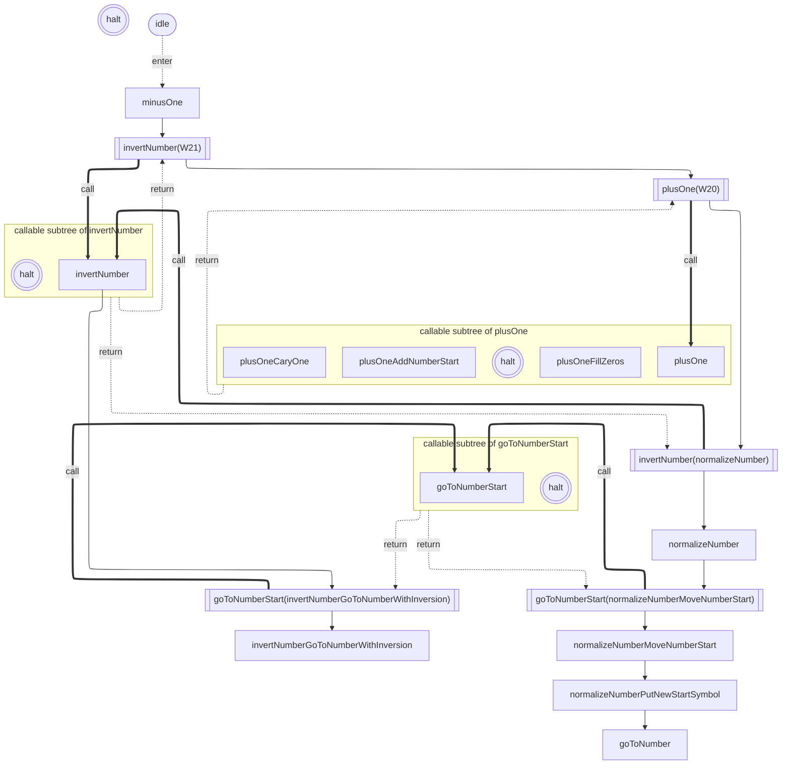
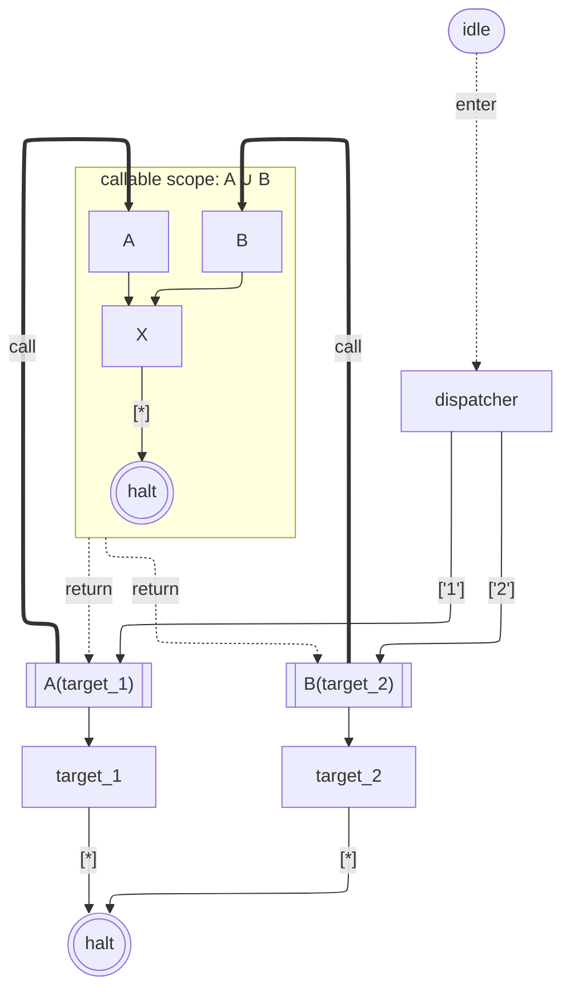
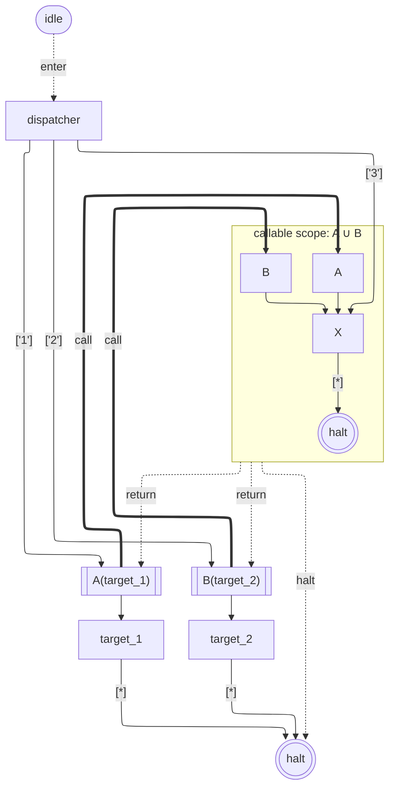

# Callable-subtree visualization for `withOverriddenHaltState`

**Status:** DRAFT 2026-05-21 — supersedes the earlier "transitive-closure halt-frame" framing of this doc. Tracks [#174](https://github.com/mellonis/turing-machine-js/issues/174). Lands on the `v7` integration branch before v7 stable cut. **Previous implementation (frameId-based exclusive-reachable algorithm in `State.toGraph`) is being reverted in favor of the design below.**

**Relation to [#173](https://github.com/mellonis/turing-machine-js/issues/173):** #173 closed (2026-05-21) as the literal complaint (orphan `c_N` + onHalt anchor) doesn't apply to the new design — there's no `c_N` per-wrapper concept anymore. The new design has per-bare `c_A` halt sinks and per-wrapper call/return/onHalt edges, which together visualize runtime semantics directly.

## The reframing

`withOverriddenHaltState` is, structurally, **a function call**. When you write `W = A.wohs(target)`:

- `W` is a **call site** — invoking it pushes `target` onto the halt-stack and delegates to `A`'s transitions.
- `A` (or rather, the subtree forward-reachable from `A`) is the **callable body**.
- The "halt" at the end of `A`'s execution is a **return point** — the stack pop kicks the override into action.

So the runtime model is "graph of callable subtrees, dispatched from a top-level driver." The diagram should reflect that directly.

## Mental model & vocabulary

| Concept | Visualization |
|---|---|
| **Callable subtree** of a bare `A` | `subgraph subtree_A["callable subtree of A"]` block containing `A`, A's body states, and a local halt sink `c_A` |
| **Wrapper** `W = A.wohs(target)` | A `[[A(target)]]` node OUTSIDE the subtree |
| **Call** (wrapper → bare) | Bold `==>` arrow labeled `call`. **Reserved**: only wrappers emit bold arrows, and only to their bare. Other transitions whose target happens to be a wrapper (e.g., dispatcher → W1) stay as regular solid `-->`. Multiple wrappers sharing a bare collapse into one `==>` ribbon via Mermaid `&` syntax: `s_W1 & s_W2 == call ==> s_A` |
| **Return** (subtree halt → wrapper) | Dotted `-.->` arrow from the SUBGRAPH back to each wrapper, labeled `return`. Multiple wrappers collapse via `&` on the target side: `subtree_A -. return .-> s_W1 & s_W2`. **Demand-emit** — only emitted when `c_A` has at least one incoming edge AND the wrapper actually calls this subtree |
| **Halt** (subtree halt → real halt) | Dotted `-.->` arrow from the SUBGRAPH to `s0`, labeled `halt`. **Demand-emit** — only emitted when `c_A` has incoming edges AND there's a non-wrapper entry path (solid `-->`) into any state in the subtree. Fires when the subtree is entered without a wrapper on the stack |
| **Wrapper's outgoing** (post-return continuation) | Solid `-->` arrow from wrapper to its override target. Just a regular transition — the wrapper "transitions to" its override after the return fires |
| **Idle sentinel** | `idle([idle])` + dotted `idle -. enter .-> initial` (unchanged from v7 alpha.1) |
| **Real halt** | `s0(((halt)))` at top level (unchanged from v7 alpha.1) |
| **Local subtree halt** | `c_A(((halt)))` inside the subtree's subgraph block — body halts visually land here |

## Arrow style summary

| Style | Used for |
|---|---|
| Solid `-->` | Regular state-to-state transitions, including (a) wrapper → override target, and (b) any non-wrapper state's transitions, even when their target is a wrapper |
| Bold `==>` | **Only** the wrapper-to-bare `call` arrow. Source is always a wrapper; target is its bare |
| Dotted `-.->` | Frame-level dispatch (subtree return, subtree halt, idle enter) |

Bold `==>` is reserved — it's the visual signature of "a wrapper calling into its callable subtree." Counting bold arrows in the diagram tells you exactly how many wrappers are in play. (Departs from v7 alpha.1's "bold-into-any-wrapper" rule; under that older rule, dispatcher → W1 was also bold. Under the new rule, it's solid — the reader sees W1's `[[…]]` shape and infers "wrapper" without needing redundant arrow styling on every transition into it.)

## Examples

### Example 1 — simple wrapper

`A.withOverriddenHaltState(target)`, no shared bare:



Reading the runtime: idle → enter → W → call → subtree → body halts at c_A → return to W → W's `--> s_target` → s_target → halt.

**No `halt` arrow** from the subtree to `s0`: there's no non-wrapper entry path into the subtree (only `s_W == call ==>` enters it), so the empty-stack case never fires. The `halt` arrow is demand-emit and omitted here.

### Example 1b — PostMachine subroutine (the canonical motivating case)

`PostMachine` program `{ 1: call('rightToBlank'); 2: mark; 3: stop; rightToBlank: { 1: right; 2: check(1,3); 3: stop } }`. PostMachine constructs internally:

- A **hopper state** named `rightToBlank` whose only transition is `[ifOtherSymbol]: nextState = rightToBlank::1` (forward to the first body state).
- **Body states** `rightToBlank::1` (the `right` command) and `rightToBlank::2` (the `check` command).
- A **continuation state** `1~2` (where control resumes after the subroutine returns).
- A **wrapper** `W = rightToBlank.withOverriddenHaltState(continuation_1~2)`.
- A **top-level instruction 2** (`mark`), reached via the continuation.



**What this resolves vs. alpha.1's emit:**

- Body states `rightToBlank::1` and `rightToBlank::2` are INSIDE the subtree (alpha.1 put them outside).
- The check's halt-bound transition (`s_body2 -- "[B]" -->`) retargets to `c_rightToBlank` instead of `s0` (alpha.1 emitted `→ s0`, misleading about runtime).
- No orphan halt marker — `c_rightToBlank` has incoming from `s_body2`. The condition that prompted #173 doesn't arise.
- The wrapper `s_W[["rightToBlank(1~2)"]]` sits OUTSIDE the subtree as a separate node — it's the call site, not the bare.

Runtime trace reads off the diagram: `idle → W → call → hopper → body_1 → body_2 → c_rightToBlank → return W → continuation → instruction_2 → s0`. Each arrow corresponds to a runtime step.

### Example 2 — multi-wrapper sharing a bare

Two wrappers `W1 = A.wohs(target_B)` and `W2 = A.wohs(target_C)`, dispatcher routes:



Dispatcher's outgoing arrows to W1, W2, and A are all solid `-->` (regular transitions). The reader sees W1 and W2 are wrappers because of the `[[…]]` shape. Two bold `call` arrows in the diagram (the wrappers' calls into A's subtree) — exactly the count of wrappers in play. The subtree's `-. return .->` arrows go back to both wrappers (collapsed via `&`); the `-. halt .->` arrow handles the dispatcher's direct entry path (`['#']`).

### Example 3 — self-wrapping (`A.wohs(A)`)



Legal API call (no self-reference validation). Runtime: W push A → A halts → pop A → control to A → A halts again → real halt. The diagram captures both arrows from W to A: bold `call` (entering A under W's stack frame) and solid `-->` (W's "post-return continuation IS A again"). Pattern is "run A twice in sequence."

### Example 4 — nested `.wohs()` chain

Two cases worth comparing: (4a) the chain `.wohs().wohs()` with only the outer entered, and (4b) two independently-referenced wrappers around the same bare.

#### 4a. Chain construction, only outer entered

```ts
const W1 = A.withOverriddenHaltState(target_1);
const W2 = W1.withOverriddenHaltState(target_2);
// Only W2 is referenced from the entry — W1 is never independently entered.
```



**Only ONE wrapper appears in the graph: `s_W2`.** `W1` is structurally absorbed — at runtime, only W2's override (`target_2`) is pushed onto the stack; `target_1` is never on the stack so it never fires. The composite name `A(target_1)(target_2)` is the engine's `state.#name`; it shows the construction chain textually but is technically misleading about runtime behavior (only `target_2` actually fires). Sibling-style emission (no nested frames) is the right rendering because the runtime is single-level.

**Runtime trace:** idle → W2 → call subtree_A → A halts at c_A → return to W2 → W2 transitions to `target_2` → target_2 halts → s0.

`halt` arrow omitted (no non-wrapper entry to subtree_A).

#### 4b. Two independent wrappers, both referenced

```ts
const W1 = A.withOverriddenHaltState(target_1);
const W2 = A.withOverriddenHaltState(target_2);
const dispatcher = new State({
  [sym_a]: { nextState: W1 },
  [sym_b]: { nextState: W2 },
}, 'dispatcher');
```



**Two wrappers, both as siblings.** Dispatcher chooses which via input symbol — solid arrows from dispatcher to each wrapper (regular transitions; the `[[…]]` shape on W1 and W2 tells the reader they're wrappers). Each wrapper has its own bold `call` arrow into the subtree.

This is how `library-binary-numbers/minusOne` is built (five sibling wrappers around two distinct bares).

The visual distinction between 4a and 4b: **count the bold `==>` arrows**. 4a has one (W2's call); 4b has two (W1's and W2's). One bold arrow per wrapper in the graph, by construction.

### Example 5 — Reference cycle (dead wrapper)

`A` loops to itself via `Reference`; `W = A.wohs(target)`:



`c_A` is **orphan** (no `--> c_A` edge): `s_A` loops back to itself via the Reference and never halts. Per the demand-emit rule, `subtree_A -. return .->` and `subtree_A -. halt .->` are BOTH omitted because `c_A` has no incoming edges — neither dispatch path is structurally reachable. Reader sees: "the subtree's `c_A` is unreachable. Whatever the wrapper redirects to (`target`) is also unreachable. Dead wrapper."

The orphan `c_A` alone IS the dead-wrapper signal — no need for orphan return/halt arrows.

## minusOne as a worked example

`library-binary-numbers/minusOne` is a 4-deep wrapper composition that exercises shared bares + override chains. Probed under the union-find rule (2026-05-21): five wrappers, three subtrees.

**Wrapper instances** (constructed via `.withOverriddenHaltState`):

- `W10 = goToNumberStart.wohs(invertNumberGoToNumberWithInversion)`
- `W14 = goToNumberStart.wohs(normalizeNumberMoveNumberStart)` — same bare, different override
- `W20 = invertNumber.wohs(normalizeNumber)`
- `W22 = invertNumber.wohs(W21)` — wraps invertNumber, override is plusOne wrapper
- `W21 = plusOne.wohs(W20)` — wraps plusOne, override is invertNumber wrapper

**Subtree decomposition** (3 unique bares):

- `subtree_goToNumberStart`: contains `goToNumberStart` bare only (no body; halts directly).
- `subtree_invertNumber`: contains `invertNumber` bare only (no body; transitions delegate to `goToNumberStart` wrapper externally).
- `subtree_plusOne`: contains `plusOne` bare + body states (`plusOneFillZeros`, `plusOneAddNumberStart`, `plusOneCaryOne`).

**Compared to alpha.1's emit** (5 subgraph blocks, per-context-duplicated bares): the new emit has **3 subgraph blocks** and de-duplicates the shared bares (`goToNumberStart` and `invertNumber` each appear once instead of twice).



Reading the override chain: `minusOne → W22 → W21 → W20 → normalizeNumber → W14 → normalizeNumberMoveNumberStart → … → real halt`. Each wrapper's solid `-->` to its override target chains the runtime call sequence.

Reading the bare-sharing: both `W10` and `W14` call into the SAME `subtree_goToNumberStart`. Both `W20` and `W22` call into the SAME `subtree_invertNumber`. This de-duplication is invisible in alpha.1's emit (it emits two `goToNumberStart` and two `invertNumber` subgraphs).

**Union-find didn't trigger** for minusOne because each bare's forward-reachable set is just itself (the bares transition either to halt or to other wrappers, never directly into each other's body states). Union-find applies to scenarios like the dispatcher+shared-X case, not chained compositions.

## Reachability rules (what's inside the subtree)

For each wrapped bare `A`, the callable subtree contains:
- `A` itself.
- Every state forward-reachable from `A` via its transitions, following `Reference#ref` transparently.
- The synthesized halt-marker `c_A` (always emitted — see Edge cases for the dead-wrapper rationale).

**Each state is rendered exactly once. Containers are computed via union-find on wrapper reachability:**

1. **For each wrapped bare** `B`, compute `reach(B)` = forward-reachable set starting from B (following transitions and `Reference#ref` transparently).
2. **Compute connected components** of wrappers by overlap: wrappers `W_i` and `W_j` are in the same component iff `reach(bare(W_i)) ∩ reach(bare(W_j)) ≠ ∅` (their reachable sets share at least one state). Transitive closure of the overlap relation.
3. **Each connected component** becomes one **callable scope** (a subgraph frame in the emit). The frame contains: every state in the union of `reach(bare(W))` for all wrappers in the component, plus a single halt marker `c_union`.
4. **States outside any wrapper's reach** stay at top level (e.g., dispatcher, override targets, real halt singleton, `idle`).

Frame name: `callable subtree of <bare>` for a single-bare component; `callable scope: A ∪ B ∪ …` for multi-bare components.

**Demand-emit rules** (refined):

- `c_union` always present (orphan marker is the dead-wrapper signal — see Edge cases).
- `frame -. return .-> W` emitted iff `c_union` has incoming edges AND wrapper W has a `call` arrow into the frame.
- `frame -. halt .-> s0` emitted iff `c_union` has incoming edges AND there is **at least one solid `-->` arrow** entering any state inside the frame (a non-wrapper entry path).

Cross-subgraph arrows are allowed and natural — Mermaid supports arrows whose source and target sit in different subgraph blocks. A state in the union frame may be the target of an arrow from outside (dispatcher → X, e.g.), or the source of an arrow to outside (frame member → wrapper override target).

**No per-context duplication.** Today's v7 alpha.1 duplicates shared bares (e.g., `library-binary-numbers/minusOne` shows `invertNumber` as both `s20` and `s22` in its emit). Under the callable-subtree model, there's a single `subtree_invertNumber` and both wrappers `call ==>` into it via the `&` syntax. The diagram is smaller and the runtime "same instance, multiple call sites" semantic is visualized exactly. No same-instance marking is needed because no node is duplicated.

## Edge cases

### `c_A` always emitted

Every wrapped bare gets a `c_A(((halt)))` inside its subtree subgraph, even when:
- The bare has no halt-bound transitions in its reachable set (dead wrapper — Reference cycle case).
- The body has halt-bound transitions but none happen to land on `c_A` directly (e.g., halts via intermediate paths that exit the subtree).

The orphan `c_A` (no incoming `--> c_A` edge) is a meaningful signal: "this wrapper's runtime scope never produces a halt — wrapper is dead code."

### Self-wrapping (`A.wohs(A)`)

Legal. Wrapper has two arrows to A: bold `call` + solid `-->` (override target). Runtime: "run A twice in sequence." See Example 3.

### Override target is itself a wrapper

`W = A.wohs(W2)` where `W2 = B.wohs(target)`. W's outgoing to its override `W2` is a regular solid `--> s_W2` (the new convention reserves bold for wrapper-to-bare only). The reader sees W2's `[[…]]` shape and knows it's a wrapper. W2 in turn has its own bold `s_W2 == call ==> s_B` arrow into its own subtree. So the chain reads as: regular transition into a wrapper (solid), then that wrapper's bold call into its bare. Two bold arrows total (one per wrapper), regardless of how composition chains together.

### Nested `.wohs()` chain (`A.wohs(t1).wohs(t2)`)

Single wrapper emitted (outermost). Composite name accumulates the chain (`A(t1)(t2)`). Per probe finding, only `t2` actually fires at runtime; `t1` is overwritten. The composite name is technically misleading but matches engine v7 alpha.1's `state.#name` value.

### Shared body state (reachable from multiple subtrees)

When X is reachable from multiple wrapped bares whose reach sets overlap, those wrappers are in the same connected component → one **union frame** containing both bares + the shared state + a single halt marker.

**Worked example 1: no direct entry to X.** `dispatcher` reads `1` → `W1`, reads `2` → `W2`. `A → X`. `B → X`. `X` halts. `W1 = A.wohs(target_1)`, `W2 = B.wohs(target_2)`.

`reach(A) = {A, X}` and `reach(B) = {B, X}` overlap on X → union component {W1, W2} → one frame containing {A, B, X, c_union}.



X is inside the union frame. Both wrappers have `call` arrows to their respective bare entry points (W1 → A, W2 → B) — both bares live in the same scope. `c_union` has X's halt-bound transition landing on it.

No `halt` arrow emitted — there's no solid `-->` entry into the union frame (only bold `call` from wrappers). The runtime never reaches `c_union` with an empty stack, so falling through to `s0` is structurally impossible.

**Worked example 2: dispatcher adds direct entry to X (`['3'] → X`).** Now there's a non-wrapper entry into the union frame.



Cross-subgraph entry `s_disp -- ['3'] --> s_X` triggers the `halt` arrow to emit. All three runtime paths from dispatcher are now traceable: `1` → W1 → call → halt at c_union → return W1 → target_1 → s0; `2` → W2 analogously; `3` → directly to X (inside union) → halt at c_union → empty-stack `halt` arrow → s0.

The union model degrades gracefully — adding direct entry to a state inside the union just flips the `halt` arrow on. No new structural concept needed.

## Data model changes

The callable-subtree model **un-collapses what v7 alpha.1 collapsed**. In alpha.1, each `withOverriddenHaltState` wrapper produces ONE `GraphNode` representing both the wrapper and its bare (the bare is "collapsed onto" the wrapper's id, with `isWrapped: true`). Under the new model, **wrappers and bares are separate `GraphNode` instances**:

- **Bare node** (`isWrapper: false`, regular `["…"]` shape) — lives inside its callable subtree. There's exactly one bare node per unique wrapped `State` instance.
- **Wrapper node** (`isWrapper: true`, `[[…]]` shape, has `bareStateId: number`) — lives outside any subtree. There's one wrapper node per `withOverriddenHaltState` call. Multiple wrappers can share the same `bareStateId` if they wrap the same bare with different override targets.
- **Halt marker** (`isHaltMarker: true`, `(((halt)))` shape inside subtree) — one per subtree, retargets the bare's halt-bound transitions.

`GraphNode` field changes (proposed names; subject to implementation):

| Field | alpha.1 | New model |
|---|---|---|
| `isWrapped: boolean` | True for collapsed-wrapper nodes | **Renamed/repurposed:** drop in favor of `isWrapper: boolean` |
| `isWrapper: boolean` | n/a | True for external `[[…]]` wrapper nodes |
| `bareStateId: number \| null` | n/a | Set on wrappers; points to the bare's `GraphNode` id |
| `frameId: number \| null` | n/a (P1 added it; superseded) | Set on bare, body states, and halt marker — the id of the containing subtree |
| `isHaltMarker: boolean` | True for synthesized halt markers | Same |
| `overriddenHaltStateId: number \| null` | Set on collapsed-wrapper nodes (= override target's id) | Set on wrapper nodes |

**`State.toGraph` second pass** (the reachability + frame-assignment + halt-retargeting work):

- Pass 1 enumerates `State`s reachable from the initial state. For each State:
  - If the State is wrapped (`#overriddenHaltState !== null` AND `#bareState !== null`): produce TWO nodes — a wrapper node (`isWrapper: true`, with the wrapper's id and composite name) AND a bare node (regular, with the bare's id and name) IF the bare doesn't already have a graph node from another wrapper context.
  - If the State is not wrapped: produce one regular node.
- Pass 2 assigns `frameId` via union-find on bare reachability: each unique bare's forward-reachable set (following the bare's transitions and `Reference#ref` transparently) defines its candidate subtree. When two bares' reach sets overlap, they merge into one union frame. Each frame gets a single halt marker.
- Halt-bound transitions of any in-frame state retarget to the frame's halt marker.

`Graph` itself: no structural change beyond the per-node field additions.

## Emit changes

### `toMermaid`

- Subgraph emission unchanged in shape (`subgraph w_N["callable subtree of NAME"]` with bare + body + halt marker inside).
- **Frame-level outgoing arrows** added: for each wrapped subtree, emit:
  - One `subtree_N -. return .-> wrapper_id` per wrapper that calls this subtree.
  - One `subtree_N -. halt .-> s0` always.
- **Wrapper's `onHalt` edge removed.** Replaced by a solid `--> override_id` regular transition — always solid, regardless of whether the override is a wrapper (the new convention reserves bold for wrapper-to-bare `call` arrows only; the reader identifies the override as a wrapper, if it is one, by its `[[…]]` shape).
- **`call` label** added to bold arrows entering a wrapped subtree. The `&` multi-source syntax groups multiple wrappers sharing a bare into one ribbon.
- **Same-instance class assignments** if Option B/C selected.

### `fromMermaid`

- Parse subgraph membership → set `frameId` on nodes inside (already done in current draft).
- Parse `-. return .->` and `-. halt .->` arrows → no Graph data change needed (these are derivable from frame membership and structure at emit time, OR stored as a separate field). **TBD.**
- Parse `== call ==>` arrows: regular transitions whose target is a wrapper. Already handled.

### `fromGraph`

Unchanged. Frame membership and return/halt arrows are visualization concerns; runtime reconstruction reads `transitions` and `overriddenHaltStateId` from each node and builds State instances.

## Round-trip

`toGraph → toMermaid → fromMermaid → toGraph`:
- Data model survives if `frameId` is preserved across round-trip (already done).
- **TBD:** verify `library-binary-numbers/minusOne` round-trips byte-stable. Since the new model eliminates per-context duplication, the previous "shared-bare ordering" caveat is gone — `minusOne` should be cleaner under the new emit.

## Implementation outline

1. **Revert previous implementation** (the exclusive-only `frameId` pass in `State.toGraph` and the toMermaid grouping). Keep the `frameId` field on `GraphNode`; reuse it under the new semantics.
2. **Two-pass `State.toGraph`:**
   - Pass 1: build raw nodes (current).
   - Pass 2 (new): for each wrapper, compute the full forward-reachable set from its bare. For each in-set node, assign `frameId = wrapper.id`. For each in-set state's halt-bound transition, retarget to the wrapper's halt marker.
   - Each `State` → exactly one `GraphNode`. When a state would belong to multiple subtrees, assign it to the innermost (deepest-nested) containing subtree. External references become cross-subgraph arrows at emit time.
3. **`toMermaid` rewrite of the subgraph emission:**
   - Group nodes by `frameId`.
   - Emit `subgraph w_${id}["callable subtree of NAME"]` per group.
   - Emit `subtree_N -. return .-> wrapper_id` per wrapper that calls the subtree (derive from which wrappers' bareState produces this subtree).
   - Emit `subtree_N -. halt .-> s0`.
   - Wrapper's outgoing → override: solid `-->`, always. (Bold `==>` is reserved for the wrapper's `call` into its own bare.)
4. **`fromMermaid`:** track subgraph membership (already done); parse `return` and `halt` arrows as needed; parse `call` arrows as regular bold transitions.
5. **Tests:** Examples 1–5 above as regression cases. Existing wrapper-emission tests will need updates.
6. **Regenerate `library-binary-numbers*/states.md`** and verify visual sanity, especially `minusOne`.
7. **Update docs:** engine `CLAUDE.md`, `README.md`, this spec to IMPLEMENTED status.

## Resolved questions

### `return`/`halt` arrow storage

**Decision: derive at emit time.** `toMermaid` computes `return` and `halt` arrows from frame membership + transitions; no new fields on `Graph` or `GraphNode` beyond `frameId`.

Rationale:
- Data model stays lean — single source of truth (frame structure + transitions) drives the arrows.
- Round-trip stability is automatic: as long as `toGraph` is deterministic on `frameId` assignment (which it is per the union-find rule), `toGraph → toMermaid → fromMermaid → toGraph` produces bytewise-identical Mermaid on the second `toMermaid` call. The arrows are recomputed from the (identical) underlying structure.
- `fromMermaid` parses `return`/`halt` arrows but doesn't need to persist them in graph data — they're re-derived on the next emit. (Minor parse-then-discard cost; offset by the smaller data model.)
- Hand-edited Mermaid with inconsistent arrows is already explicitly unsupported per the engine's strict-format policy (`fromMermaid` is strict to the dialect `toMermaid` emits).

### `onHalt` keyword retirement

**Decision: retire the `onHalt` label and dotted style for wrapper-to-override edges.** The new model uses a regular solid `-->` arrow from wrapper to its override target — it's just a transition under the function-call mental model ("what fires after the call returns"). No special label needed.

The dotted `-.->` style is now exclusively reserved for **frame-level dispatch arrows**: `return` (subtree → wrapper), `halt` (subtree → real halt), and `enter` (idle → initial state).

Migration notes for the next prerelease:
- **CHANGELOG entry** — note the format change. Mermaid strings emitted by v7 alpha.1 (containing `-. onHalt .->` edges) will not parse with the new `fromMermaid`. One-way migration.
- **Engine `README.md`** — remove the "Edge arrow styles" reference to `-. onHalt .->`; replace with the new convention table.
- **Engine `CLAUDE.md`** — update the "v7 emit shape" paragraph to reflect the callable-subtree model + new arrow conventions.
- **`packages/library-binary-numbers*/states.md`** — regenerate via `npm run docs:states` after implementation lands; visual check on `minusOne` confirms the new shape reads well.

## Open questions

(None remaining; all design decisions resolved. Implementation details for `State.toGraph` un-collapsing, backward-compat strategy for alpha.1 Mermaid strings, and PR-shape decisions are captured in the [Implementation outline](#implementation-outline) and the related issues turing#175, turing#176, post-machine-js#85.)
