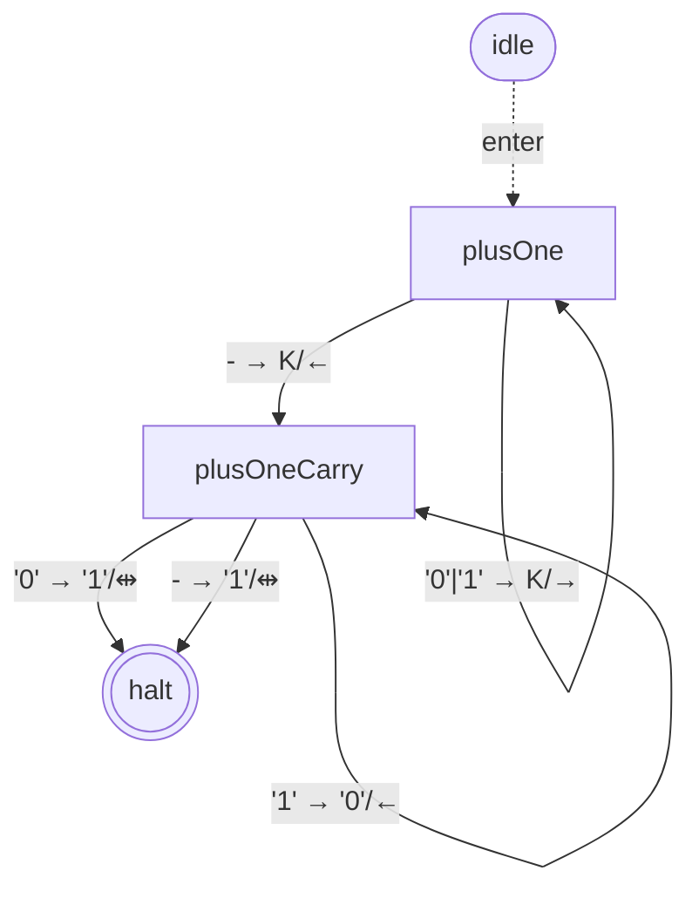
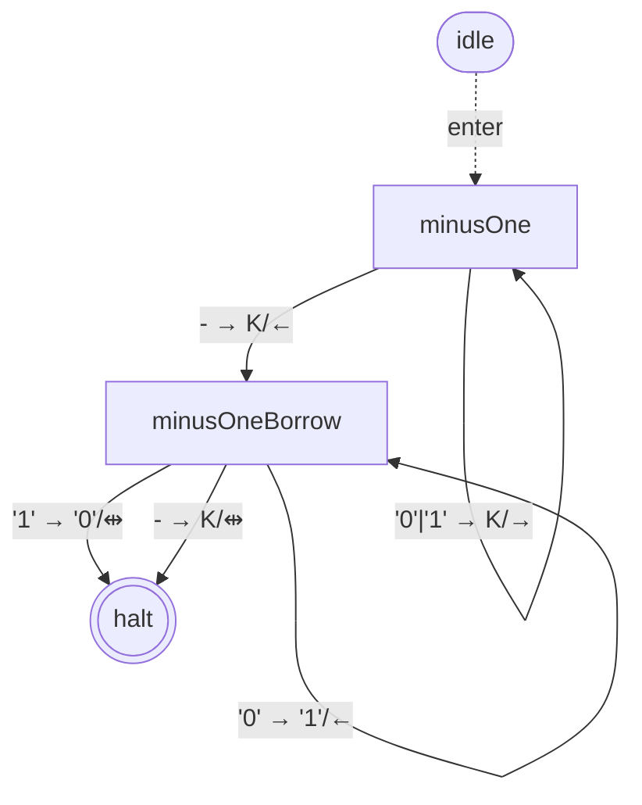
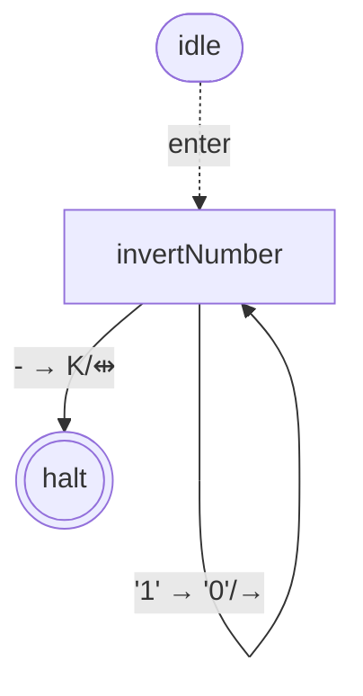
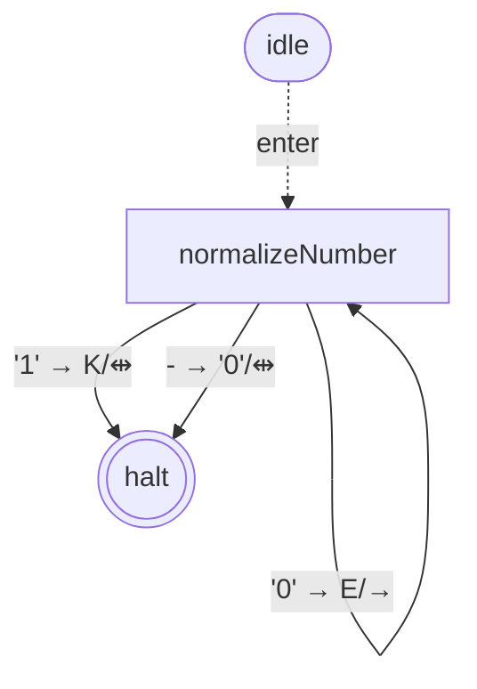

# library-binary-numbers-bare — state graphs

## plusOne

*3 states (including `haltState`)*

## minusOne

*3 states (including `haltState`)*

## invertNumber

*2 states (including `haltState`)*

## normalizeNumber

*2 states (including `haltState`)*

