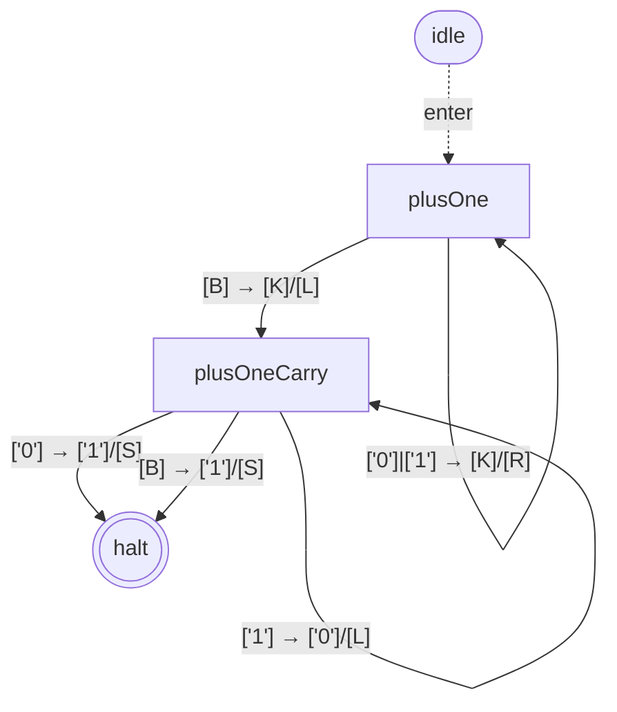
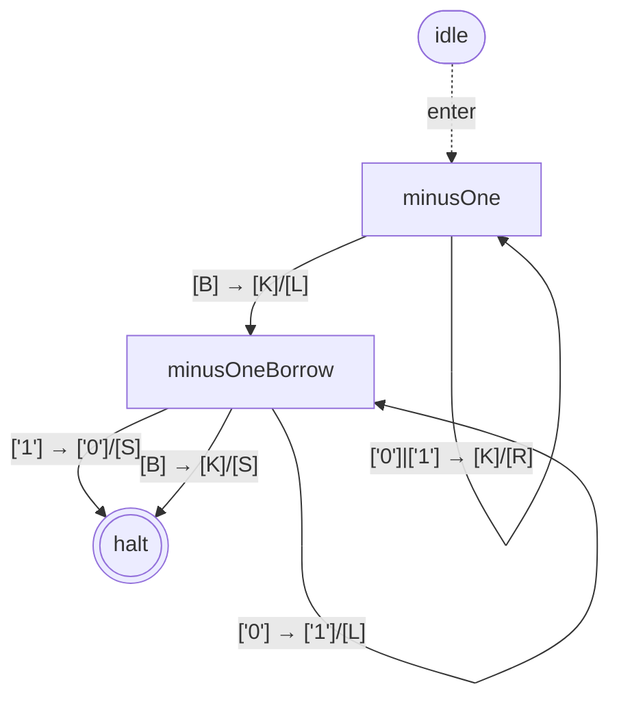
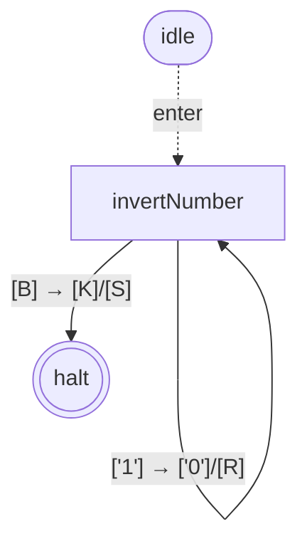
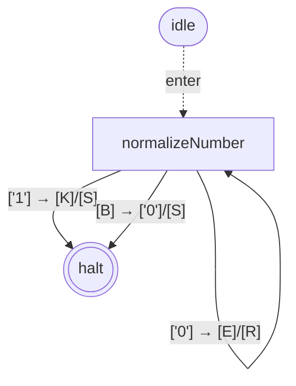

# library-binary-numbers-bare — state graphs

## plusOne

*3 states; 5 transitions; has cycles*

## minusOne

*3 states; 5 transitions; has cycles*

## invertNumber

*2 states; 3 transitions; has cycles*

## normalizeNumber

*2 states; 3 transitions; has cycles*

