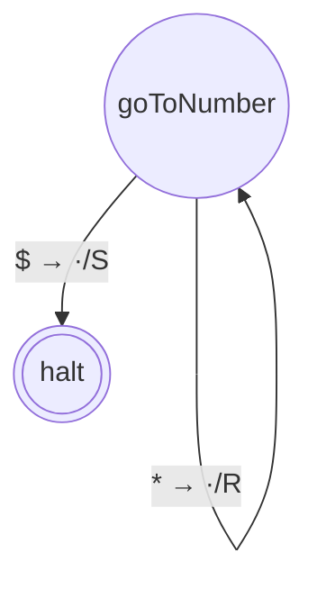
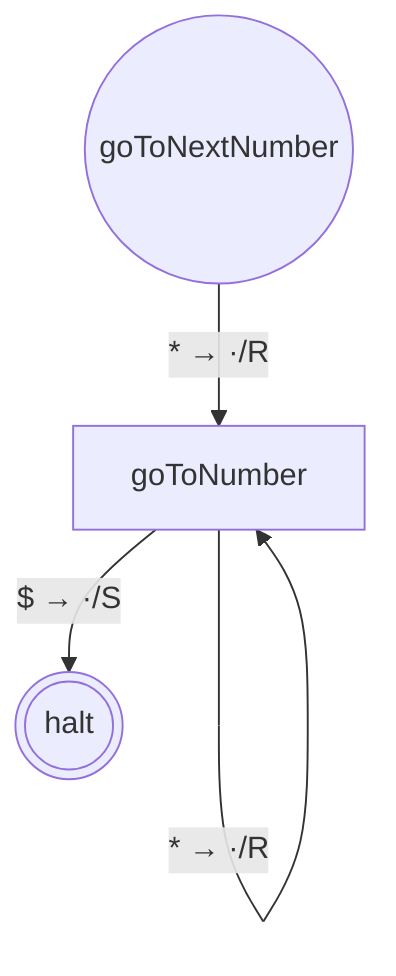
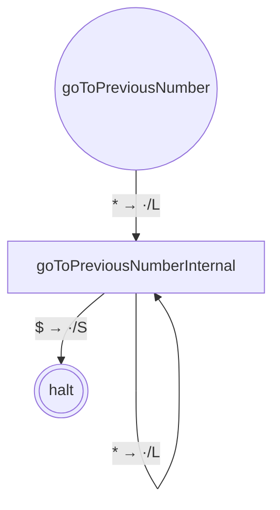
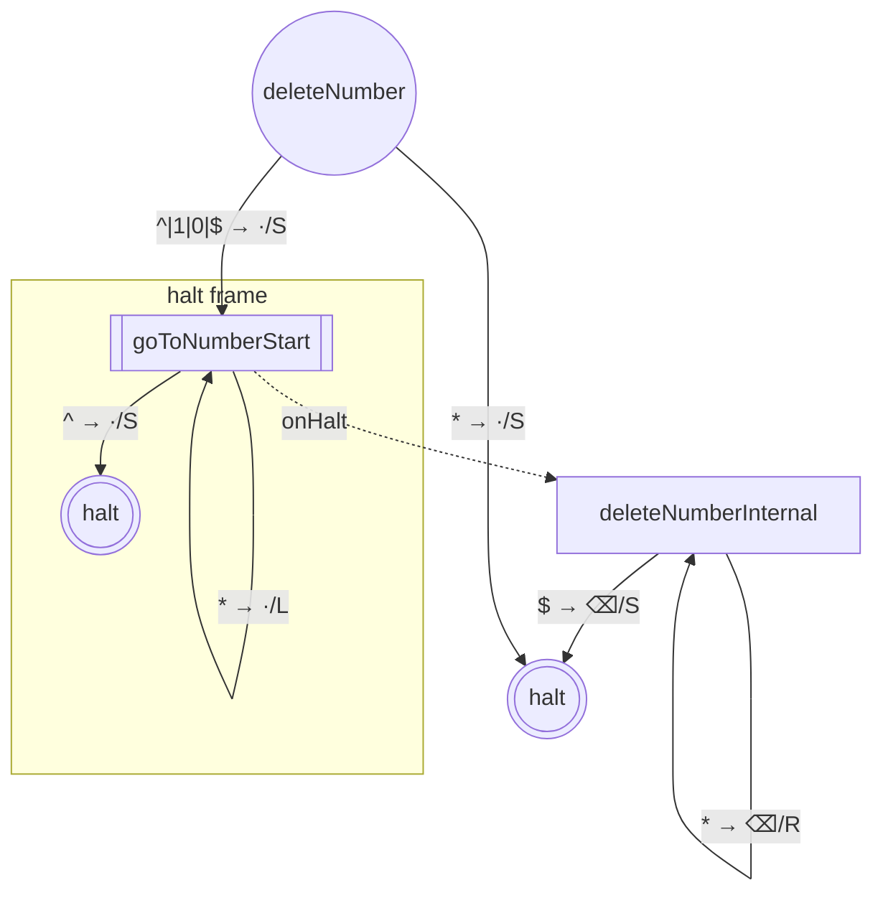
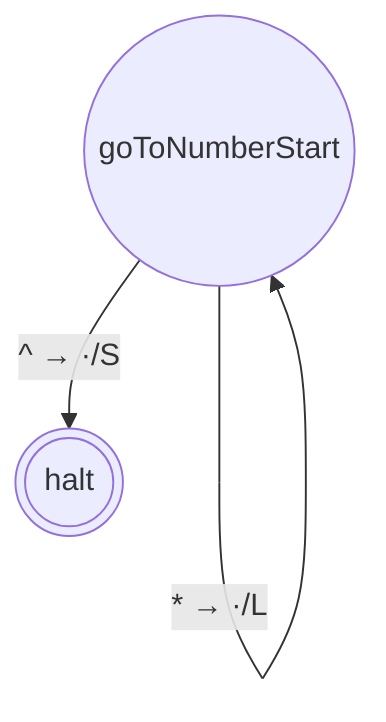
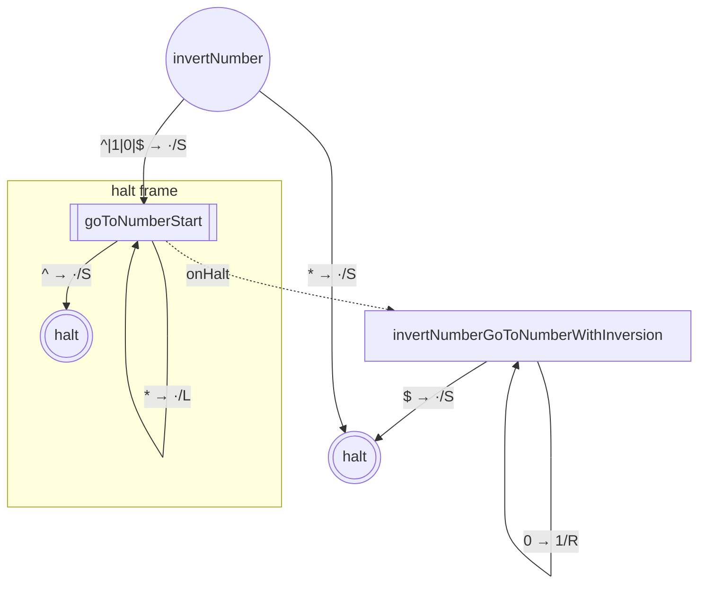
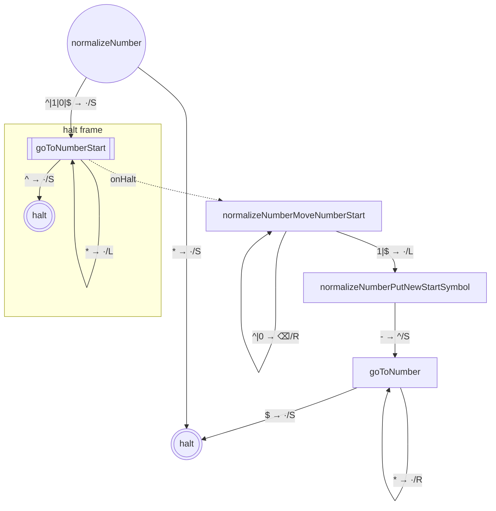
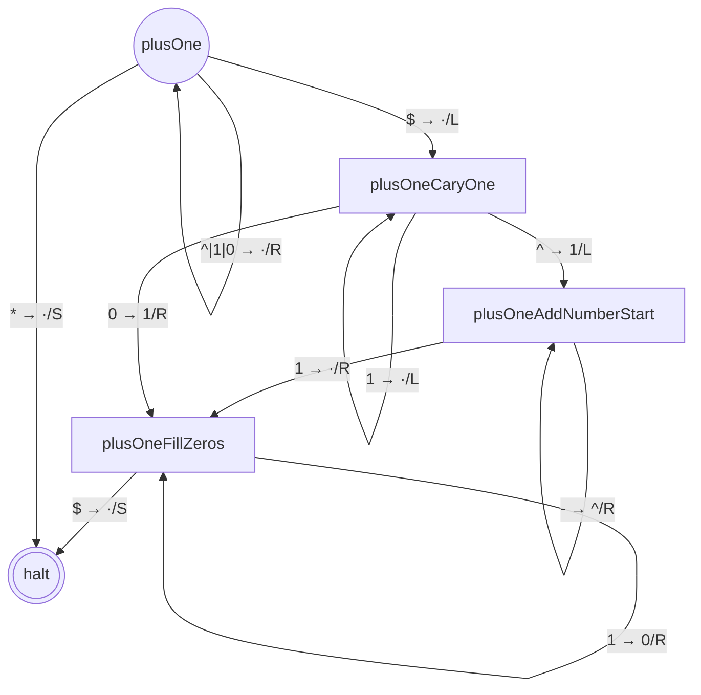
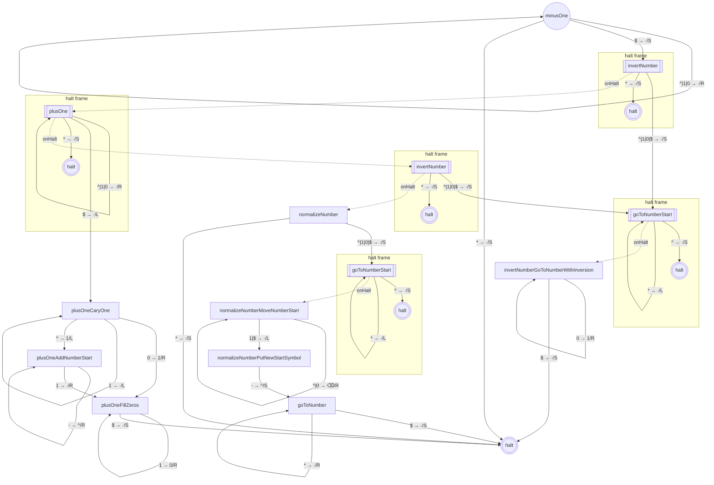
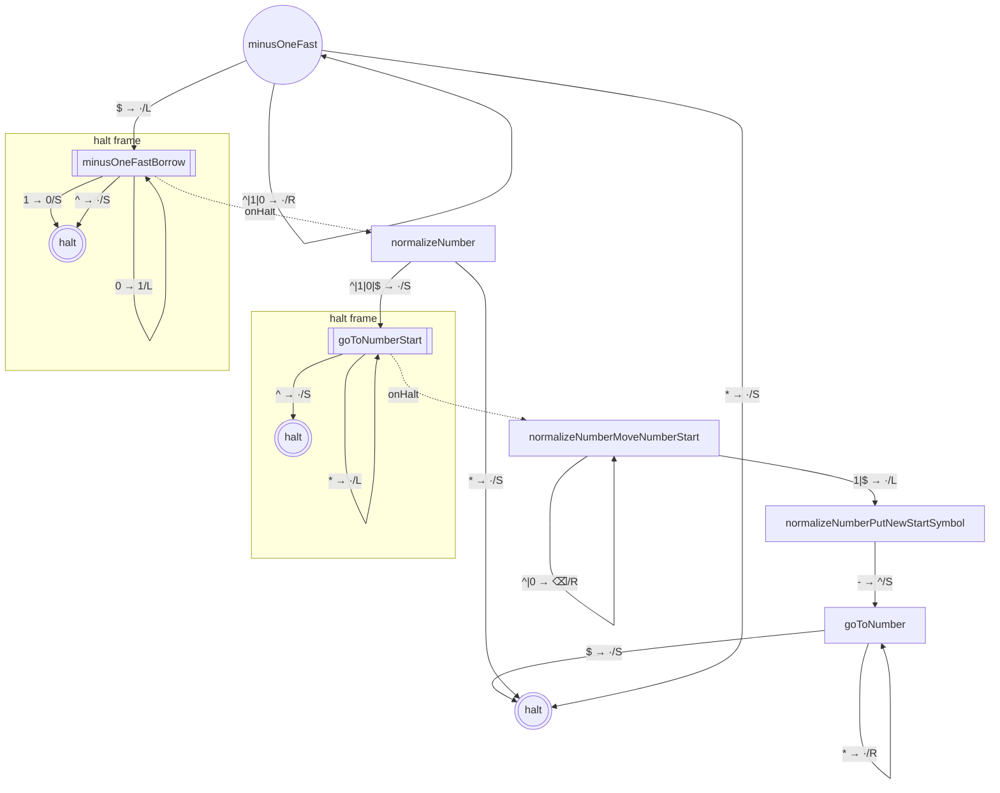

# library-binary-numbers — state graphs

## goToNumber

*2 states (including `haltState`)*

## goToNextNumber

*3 states (including `haltState`)*

## goToPreviousNumber

*3 states (including `haltState`)*

## deleteNumber

*5 states (including `haltState`)*

## goToNumbersStart

*2 states (including `haltState`)*

## invertNumber

*5 states (including `haltState`)*

## normalizeNumber

*7 states (including `haltState`)*

## plusOne

*5 states (including `haltState`)*

## minusOne

*20 states (including `haltState`)*

## minusOneFast

*10 states (including `haltState`)*

