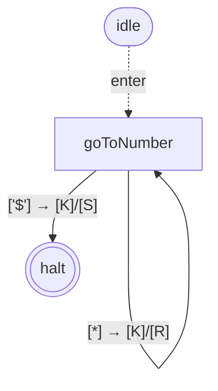
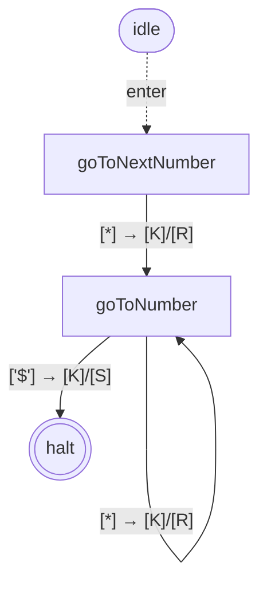
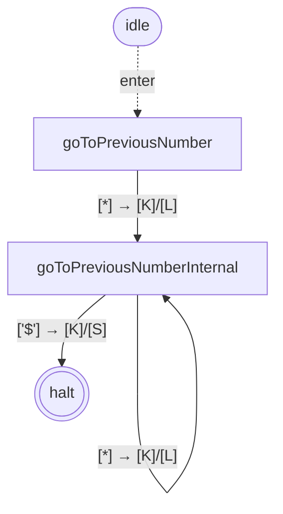
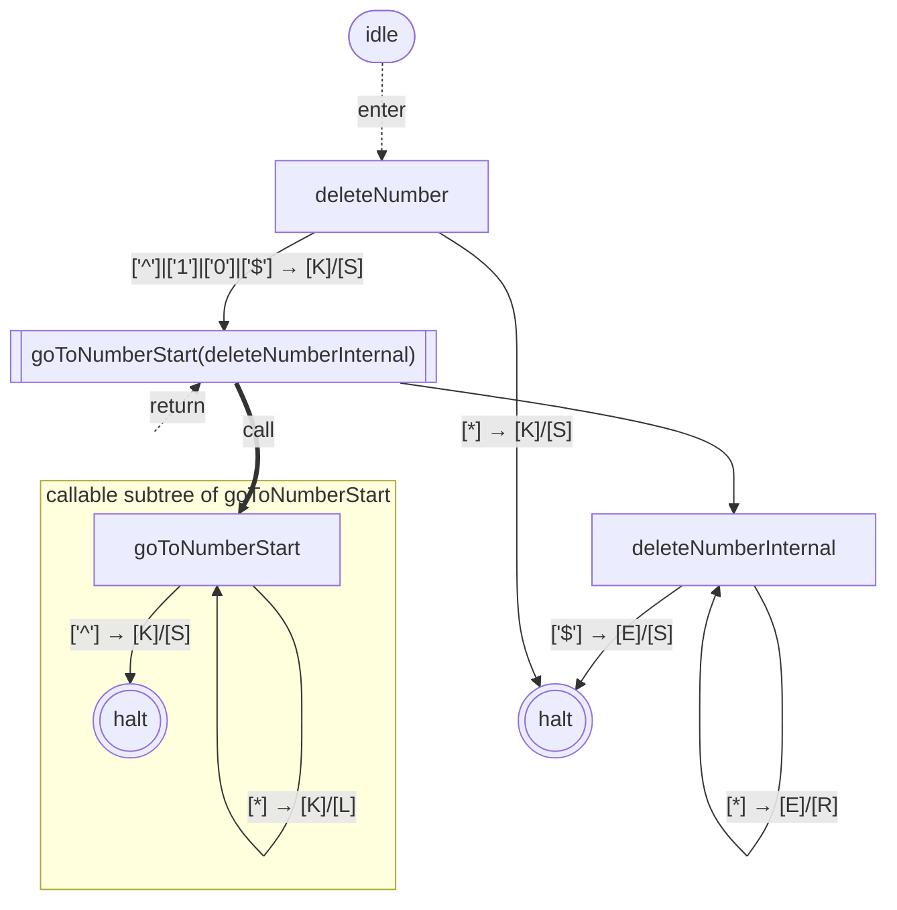
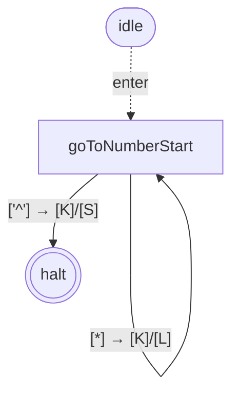
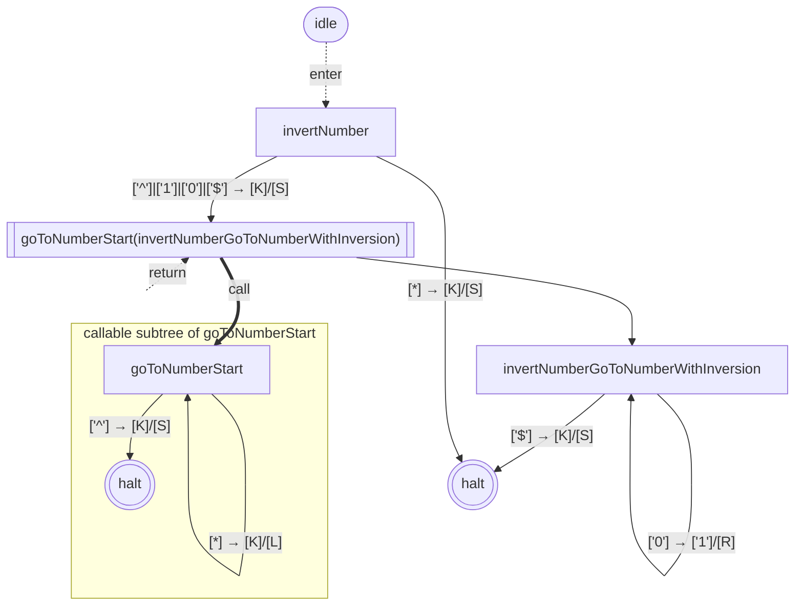
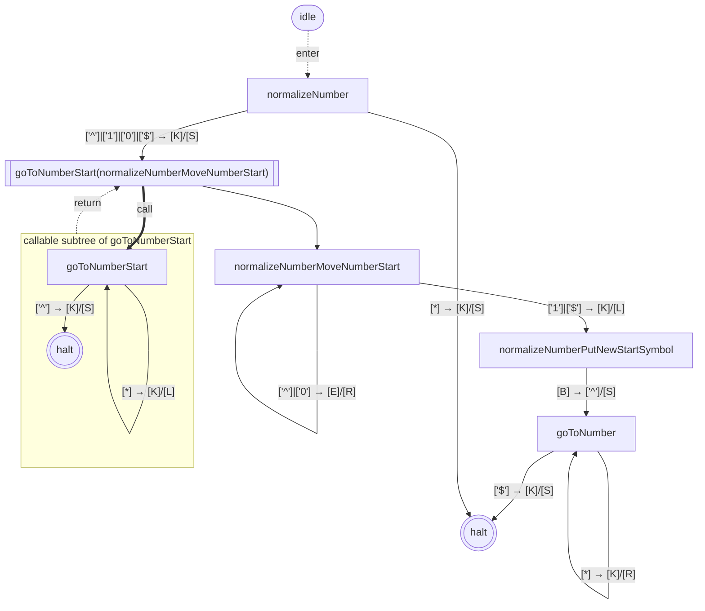
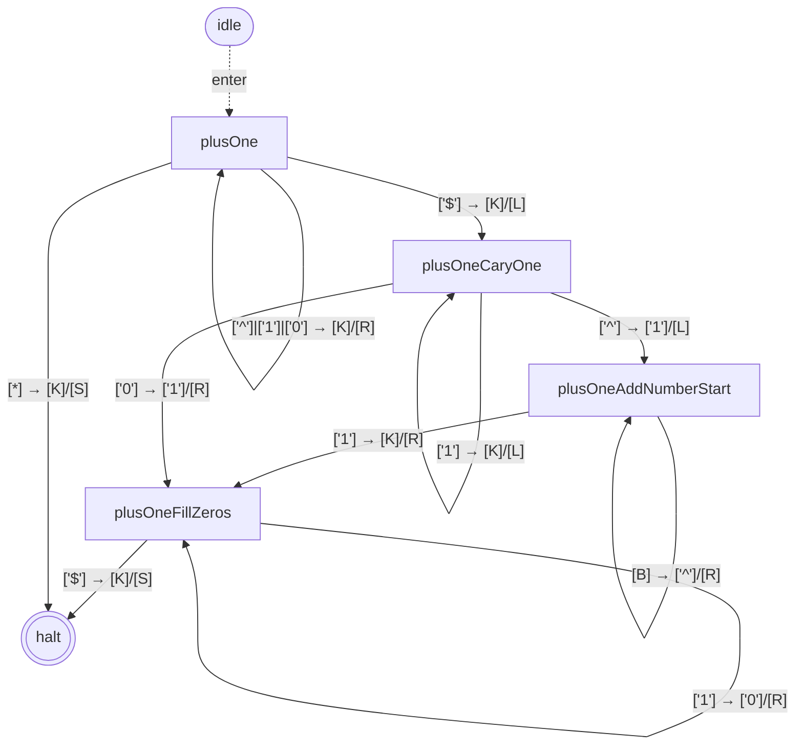
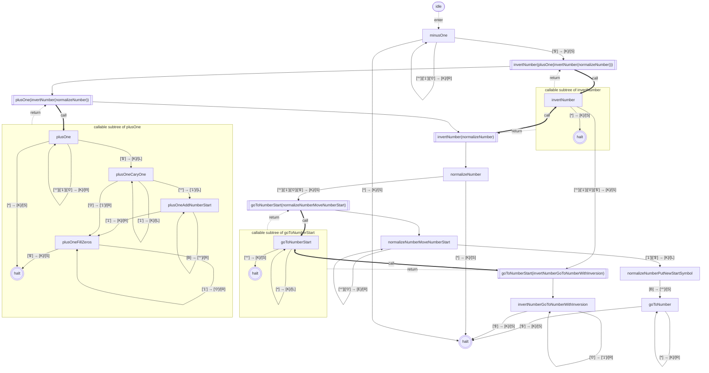
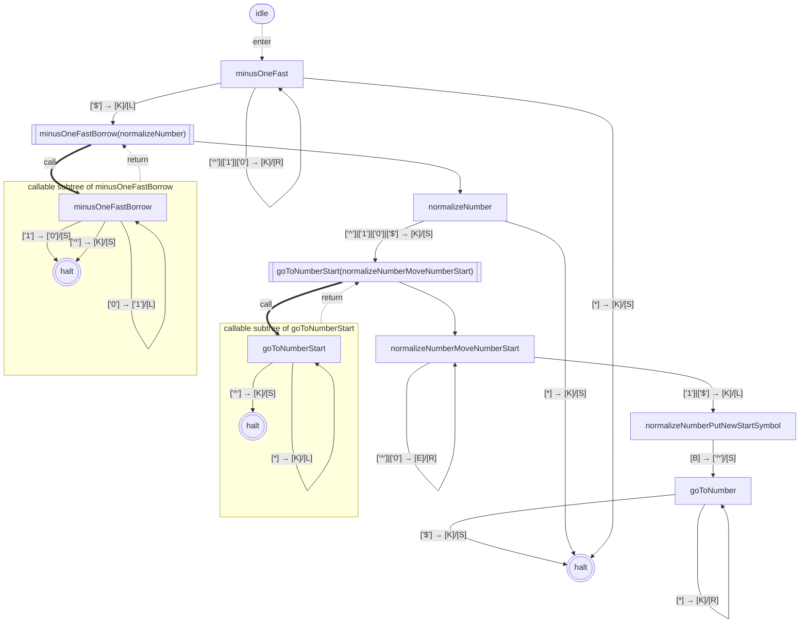

# library-binary-numbers — state graphs

## goToNumber

*2 states; 2 transitions; has cycles*

## goToNextNumber

*3 states; 3 transitions; has cycles*

## goToPreviousNumber

*3 states; 3 transitions; has cycles*

## deleteNumber

*5 states; 6 transitions; 1 wrapper (max nesting depth 1); has cycles*

## goToNumbersStart

*2 states; 2 transitions; has cycles*

## invertNumber

*5 states; 8 transitions; 1 wrapper (max nesting depth 1); has cycles*

## normalizeNumber

*7 states; 9 transitions; 1 wrapper (max nesting depth 1); has cycles*

## plusOne

*5 states; 10 transitions; has cycles*

## minusOne

*18 states; 28 transitions; 5 wrappers (max nesting depth 3); has cycles*

## minusOneFast

*10 states; 15 transitions; 2 wrappers (max nesting depth 1); has cycles*

