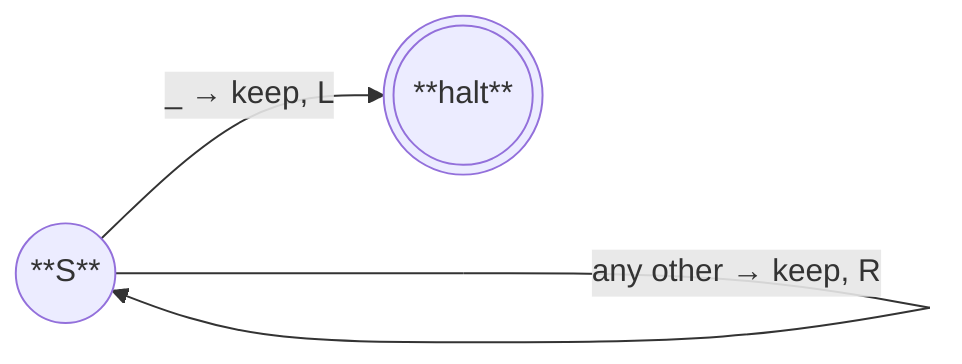
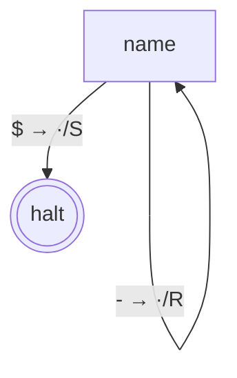
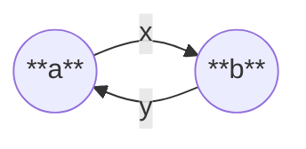

# @turing-machine-js/machine

[](https://github.com/mellonis/turing-machine-js/actions/workflows/main.yml)


Some basic objects to build your own turing machine  

## Install

Using npm:

```sh
npm install @turing-machine-js/machine
```

## Quick start

Replace every `b` on the tape with `*`:

```javascript
import {
  Alphabet,
  State,
  Tape,
  TapeBlock,
  TuringMachine,
  haltState,
  ifOtherSymbol,
  movements,
} from '@turing-machine-js/machine';

const alphabet = new Alphabet([' ', 'a', 'b', 'c', '*']);
const tape = new Tape({ alphabet, symbols: ['a', 'b', 'c', 'b', 'a'] });
const tapeBlock = TapeBlock.fromTapes([tape]);
const machine = new TuringMachine({ tapeBlock });

await machine.run({
  initialState: new State({
    [tapeBlock.symbol(['b'])]: {
      command: [{ symbol: '*', movement: movements.right }],
    },
    [tapeBlock.symbol([alphabet.blankSymbol])]: {
      command: [{ movement: movements.left }],
      nextState: haltState,
    },
    [ifOtherSymbol]: {
      command: [{ movement: movements.right }],
    },
  }),
});

console.log(tape.symbols.join('').trim()); // a*c*a
```

The state graph for the example above:



*Reading the labels: `read → write, move`. `_` is the blank symbol.*

A `State` is keyed by JS `Symbol`s returned from `tapeBlock.symbol(pattern)` — the pattern lists the expected symbol under each tape's head. `ifOtherSymbol` is the fallback key when nothing else matches; transitioning into `haltState` stops the run.

For multi-tape machines, pass one element per tape: `tapeBlock.symbol(['0', 'a'])` matches only when tape 1 is at `'0'` and tape 2 is at `'a'`.

## Building from a state table

If you prefer a textbook-style declarative API where every transition is one row of `(state, currentSymbol) → (nextState, nextSymbol, movement)`, you can build a small helper on top of the raw API. The whole thing fits in ~30 lines:

```javascript
import {
  Alphabet,
  Reference,
  State,
  TapeBlock,
  TuringMachine,
  haltState,
  ifOtherSymbol,
  movements,
  symbolCommands,
} from '@turing-machine-js/machine';

function buildFromTable({ alphabetString, initialState, finalStates, table }) {
  const alphabet = new Alphabet(alphabetString.split(''));
  const tapeBlock = TapeBlock.fromAlphabets([alphabet]);
  const movementOf = { L: movements.left, R: movements.right, S: movements.stay };

  // Pre-create a Reference per state name so transitions can point forward.
  const refs = Object.fromEntries(Object.keys(table).map((name) => [name, new Reference()]));
  const states = {};

  for (const [name, row] of Object.entries(table)) {
    const def = {};
    for (const [read, action] of Object.entries(row)) {
      const key = read === '*' ? ifOtherSymbol : tapeBlock.symbol([read]);
      def[key] = {
        command: {
          symbol: action.write ?? symbolCommands.keep,
          movement: movementOf[action.move ?? 'S'],
        },
        nextState: finalStates.includes(action.goto) ? haltState : refs[action.goto],
      };
    }
    states[name] = new State(def, name);
    refs[name].bind(states[name]);
  }

  return { tapeBlock, machine: new TuringMachine({ tapeBlock }), initialState: states[initialState] };
}

// Same "replace b with *" example as above, written declaratively:
const { tapeBlock, machine, initialState } = buildFromTable({
  alphabetString: ' abc*',
  initialState: 'scan',
  finalStates: ['HALT'],
  table: {
    scan: {
      'b': { write: '*', move: 'R', goto: 'scan' },
      ' ': {              move: 'L', goto: 'HALT' },
      '*': {              move: 'R', goto: 'scan' },  // '*' = ifOtherSymbol
    },
  },
});
```

This is what [`@turing-machine-js/builder`](../builder) provides as a separate package. Inline lets you tweak the format (multi-tape, OR-patterns, custom action shapes) freely; the builder package is more opinionated and limited to single-tape, single-symbol-per-row transitions.

## Classes

### Alphabet

The set of single-character symbols a tape can hold. The **first** symbol passed to the constructor is the blank — it fills any tape cell the head reaches before that cell has been written. At least two unique single-character symbols are required.

```javascript
const alphabet = new Alphabet([' ', '0', '1']);
alphabet.blankSymbol;   // ' '
alphabet.symbols;       // [' ', '0', '1']
alphabet.has('0');      // true
alphabet.index('1');    // 2
```

### Tape

An infinite-in-both-directions sequence of cells over an `Alphabet`, plus a head position. Cells the head moves into that haven't been written are blank.

```javascript
const tape = new Tape({ alphabet, symbols: ['a', 'b', 'c'], position: 0 });
tape.symbol;        // 'a' (cell under head)
tape.right();       // move head right; auto-extends with blanks at the edge
tape.symbol = 'X';  // write the cell under head
```

For visualization-friendly UIs, `Tape` exposes a fixed-width viewport centered on the head:

```javascript
const tape = new Tape({ alphabet, symbols: ['a', 'b', 'c'], viewportWidth: 7 });
tape.viewport;       // 7-cell snapshot centered on the head, padded with blanks
tape.viewportWidth;  // 7 (the constructor bumps even values to the next odd)
```

`viewportWidth` defaults to `1` and must be ≥ 1; `tape.viewport` always has exactly `viewportWidth` cells regardless of how many symbols the tape actually holds. Useful for rendering a sliding window in a UI; ignore if you only need `tape.symbols` / `tape.position`.

### TapeBlock

A bundle of one or more `Tape`s that the machine reads/writes together in lock-step. Construct via either factory:

```javascript
TapeBlock.fromAlphabets([alphabetA, alphabetB]);  // creates fresh blank tapes
TapeBlock.fromTapes([tape1, tape2]);              // reuses existing tapes
```

The key method is **`tapeBlock.symbol(pattern)`**: it returns an interned JS `Symbol` that simultaneously serves as a `State`'s transition key *and* matches the current configuration across all tapes. The pattern is one alphabet character per tape; pass several patterns by concatenating to express alternatives.

```javascript
tapeBlock.symbol(['^']);                  // single tape: matches '^'
tapeBlock.symbol(['^', '0', '1', '$']);   // single tape: matches any of '^', '0', '1', '$'
tapeBlock.symbol(['0', 'a']);             // 2 tapes: matches when tape 1 is '0' AND tape 2 is 'a'
```

### TapeCommand

A single-tape instruction the machine applies in one step: optionally write a symbol, optionally move the head. Defaults to *keep current symbol, do not move*.

```javascript
const cmds = [
  { symbol: '0', movement: movements.right },     // write '0' and move right
  { movement: movements.left },                   // keep current symbol, move left
  { symbol: symbolCommands.erase },               // write the blank, stay
  {},                                             // no-op
];
```

You'll rarely construct `TapeCommand` instances yourself — pass plain objects in your `State` definitions and they're wrapped automatically.

### Command

A bundle of `TapeCommand`s, one per tape in the `TapeBlock`. Like `TapeCommand`, you usually pass a plain array in the `State` definition rather than constructing `Command` directly.

### State

A node in the transition graph. Construct with a definition object whose keys are JS `Symbol`s from `tapeBlock.symbol(...)` (or `ifOtherSymbol` for the catch-all). Each value is `{ command, nextState }`.

```javascript
const s = new State({
  [tapeBlock.symbol(['1'])]: { command: { symbol: '0', movement: movements.right } },
  [tapeBlock.symbol(['$'])]: { nextState: haltState },
  [ifOtherSymbol]:           { command: { movement: movements.right } },
}, 'name');
```

Notable members and statics:

- **`state.id`**, **`state.name`** — identity (`isHalt` is `id === 0`).
- **`state.withOverrodeHaltState(other)`** — returns a copy whose would-be halt transitions fall through to `other`. The subroutine-call composition mechanism (see `library-binary-numbers/src/index.ts` for examples).
- **`State.toGraph(state, tapeBlock)`** — walks the reachable graph from `state` and returns a serializable `Graph` (states, transitions, alphabets).
- **`State.fromGraph(graph)`** — inverse of `toGraph`: rebuilds `State` instances + a fresh `TapeBlock` from a `Graph`. Round-trips together with `toMermaid` / `fromMermaid`.

For visualization, pair `State.toGraph` with `toMermaid` to render the graph in any Mermaid-aware viewer (GitHub, VS Code, mermaid.live):

```javascript
import { State, toMermaid } from '@turing-machine-js/machine';

const graph = State.toGraph(s, tapeBlock);
console.log(toMermaid(graph));
```

The string `toMermaid` produces is a real Mermaid flowchart that renders in-place anywhere Mermaid is supported:



`fromMermaid` parses the same format back into a `Graph` — the round-trip is lossless for graphs produced by `toMermaid`.

### Reference

A forward-declaration handle, used when a `State` needs to point at another `State` that doesn't exist yet (cyclic graphs). Construct unbound, pass as `nextState`, call `.bind(actualState)` once that state has been built.

```javascript
const ref = new Reference();
const a = new State({ [symbol(['x'])]: { nextState: ref } }, 'a');
const b = new State({ [symbol(['y'])]: { nextState: a  } }, 'b');
ref.bind(b);   // a's transition now resolves to b at run time
```

The resulting cycle:



`reference.ref` returns the bound state and throws if the reference is still unbound when the machine runs. `bind()` is sticky — the first call wins; subsequent calls are silent no-ops that return the existing binding.

### TuringMachine

The runtime. Owns one `TapeBlock` and drives a state graph until it reaches `haltState`.

```javascript
const machine = new TuringMachine({ tapeBlock });

// Run to halt — `run()` is async (v4+), it returns a Promise<void>:
await machine.run({ initialState, stepsLimit: 1e5 });

// Or step-by-step (useful for visualization / debugging):
for (const step of machine.runStepByStep({ initialState })) {
  console.log(step.state.name, step.currentSymbols, '→', step.nextSymbols, step.movements);
}
```

Each yielded `step` (`MachineState`) has these fields:

| Field | Type | Meaning |
|---|---|---|
| `step` | `number` | 1-indexed iteration number |
| `state` | `State` | the state about to execute |
| `currentSymbols` | `string[]` | per-tape head symbols, before the command applies |
| `nextSymbols` | `string[]` | per-tape symbols that will be written |
| `movements` | `symbol[]` | per-tape head moves (`movements.left/right/stay`) |
| `nextState` | `State` | the state that will execute next |
| `debugBreak?` | `{ before?: true, after?: true }` | only set when `state.debug` matched on this iter — see *Debugging breakpoints* below |

`stepsLimit` (default `1e5`) guards against runaway loops — exceeding it throws.

## Debugging breakpoints (v4+)

Any `State` can carry a runtime-mutable `debug` config that pauses execution at chosen points.

```ts
import { State, haltState, ifOtherSymbol, type DebugConfig } from '@turing-machine-js/machine';

const myState = new State({...});

// Pause before applying any of myState's commands:
myState.debug = { before: true };

// Pause only when the head shows symA:
myState.debug = { before: [symA] };

// Pause both before and after for the same symbol — two pauses per visit:
myState.debug = { before: [symA], after: [symA] };

// Pause when the engine is about to enter halt (program exit OR subroutine pop):
haltState.debug = { before: true };

// Disable later:
myState.debug = null;
```

> ⚠️ **`haltState.debug.after` throws.** Halt is terminal — there is no iteration-after-halt for an after-fire to anchor on. Assigning a truthy `.after` to `haltState.debug` (including `{ before: true, after: true }`) throws at write time. Symbol-list filters on `haltState.debug.before` are silent no-ops, since halt has no head symbol; only the wildcard `true` activates.

The `debug` field is mutable — toggle breakpoints at runtime without rebuilding the graph. The internal cell is shared with `state.withOverrodeHaltState(...)` wrappers, so an assignment on the original is visible from every wrapper. Plain-object input (`state.debug = { before: true }`) is wrapped in a `DebugConfig` instance automatically; the wrapper's per-property setters validate and freeze the stored array, so `state.debug.before.push(...)` throws `TypeError`.

`run()` is async and accepts an `onPause` hook:

```ts
await machine.run({
  initialState,
  onStep: (m) => { /* logger sees every step */ },
  onPause: async (m) => {
    // Awaited at every break — hold execution until you resolve.
    if (m.debugBreak?.before) console.log('before:', m.state.name);
    if (m.debugBreak?.after)  console.log('after:',  m.state.name);
  },
});
```

Both `before` and `after` for the same iteration fire on the iteration's own yield, in the order **before → step → after**. `m.state` is always the iteration's own state; the `m.debugBreak` flag (`{before: true}` or `{after: true}`) tells the consumer which timing fired.

If `onPause` is not provided, breaks fire-and-resume invisibly — the trajectory is identical to running without `debug` set.

**Filter semantics:** `true` is a wildcard (match any symbol). `[ifOtherSymbol]` is NOT a wildcard — it matches only the catch-all resolution case (same meaning as in transition keys).

**Caveat:** `haltState` is a module-level singleton. Setting `haltState.debug` affects every machine in the process; clear in `afterEach` / `finally` for test isolation.

## Special objects

### haltState

A singleton `State` (`id === 0`). Transitioning into it stops the run. Imported as a named export from `@turing-machine-js/machine`; do not construct your own — `state.isHalt` checks identity against this single instance.

### ifOtherSymbol

A sentinel `Symbol` used as a key in a `State` definition to mean *match any symbol not handled by the other keys* (the fallback transition).

### movements

Per-tape head movement directives passed in `TapeCommand.movement`:

* `movements.left` — move the head one cell left
* `movements.right` — move the head one cell right
* `movements.stay` — leave the head where it is

### symbolCommands

Special values for `TapeCommand.symbol`:

* `symbolCommands.keep` — leave the current cell unchanged (default)
* `symbolCommands.erase` — write the alphabet's blank symbol

## Introspection and testing

`@turing-machine-js/machine` ships two complementary runtime utilities:

**`summarize` / `summarizeGraph`** — *structural* analysis. Looks at the state graph without running it.

```javascript
import { summarize } from '@turing-machine-js/machine';

const stats = summarize(myState, myTapeBlock);
// {
//   stateCount, transitionCount,
//   compositionEdgeCount, maxCompositionDepth,
//   selfLoopCount, hasCycles,
//   tapeCount, alphabetCardinalities,
// }
```

`State.inspect(state)` returns the same kind of data for a single state (transitions, override-halt target, etc.) without traversing the graph.

**`equivalentOn`** — *behavioral* comparison. Runs two machines on a list of test inputs and reports whether their outputs agree, where they first diverge, and how many steps each took.

```javascript
import { equivalentOn } from '@turing-machine-js/machine';

const report = equivalentOn(
  { state: referenceState, getTapeBlock: () => referenceTapeBlock.clone() },
  { state: candidateState, getTapeBlock: () => candidateTapeBlock.clone() },
  ['^1$', '^10$', '^11$', '^111$'],   // test cases
);
// report.allAgree → true | false
// report.results[i] → { agree, referenceOutput, candidateOutput,
//                       referenceSteps, candidateSteps, firstDivergenceStep }
```

For different alphabets, pass `{ reference, candidate }` paired cases plus a custom output comparator. See [`packages/machine/src/utilities/equivalence.spec.ts`](src/utilities/equivalence.spec.ts) for worked examples.

Together: use `summarize` to ask "is this machine the right shape?" (size, composition, cycles), and `equivalentOn` to ask "does this machine compute the right thing?" (correctness against a reference). Useful when comparing two implementations of the same algorithm — e.g., the marker-based and bare binary libraries — or when grading student-written machines against a reference.

For visualization and round-tripping, see `State.toGraph` / `State.fromGraph` and `toMermaid` / `fromMermaid`.

## Libraries

- [@turing-machine-js/library-binary-numbers](https://github.com/mellonis/turing-machine-js/tree/master/packages/library-binary-numbers) — binary arithmetic with `^…$` markers, multi-number-per-tape support
- [@turing-machine-js/library-binary-numbers-bare](https://github.com/mellonis/turing-machine-js/tree/master/packages/library-binary-numbers-bare) — same operations on a 3-symbol alphabet, single-number-per-tape, much smaller state graphs

## Links

- [Turing Machine](https://en.wikipedia.org/wiki/Turing_machine) on the Wikipedia
