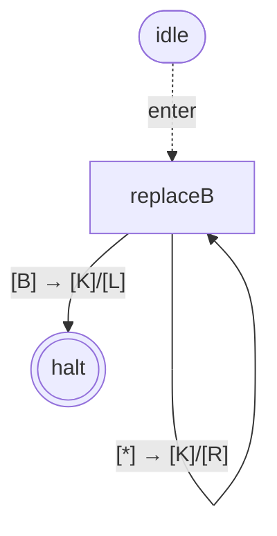
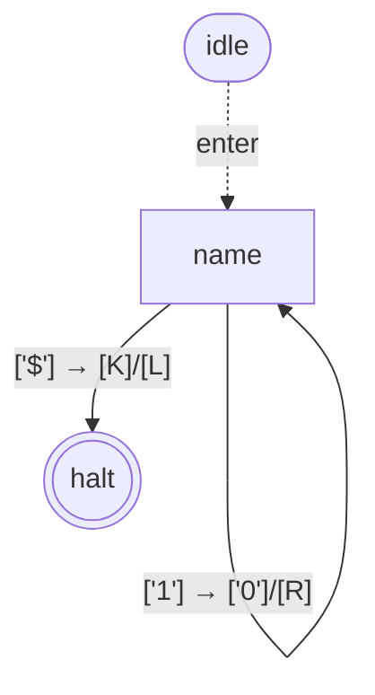
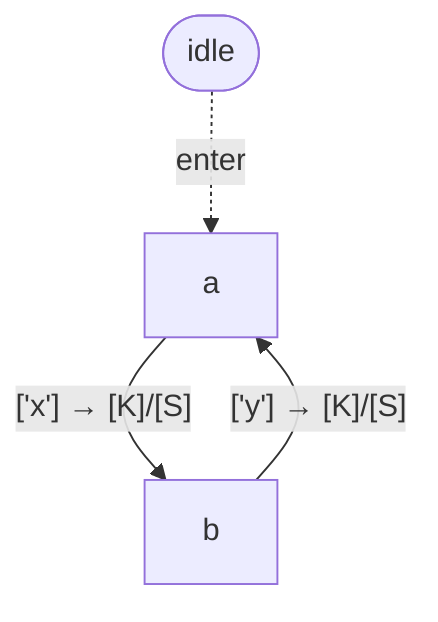
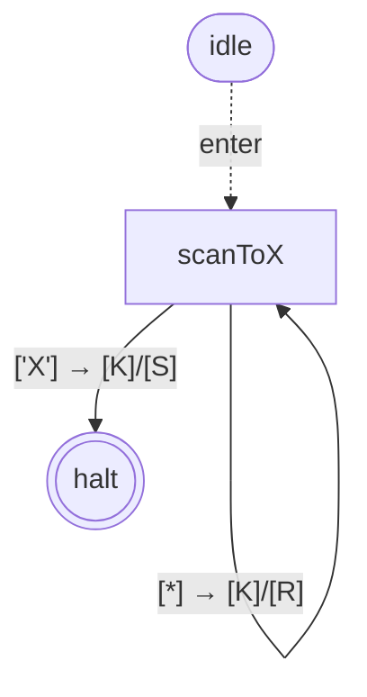
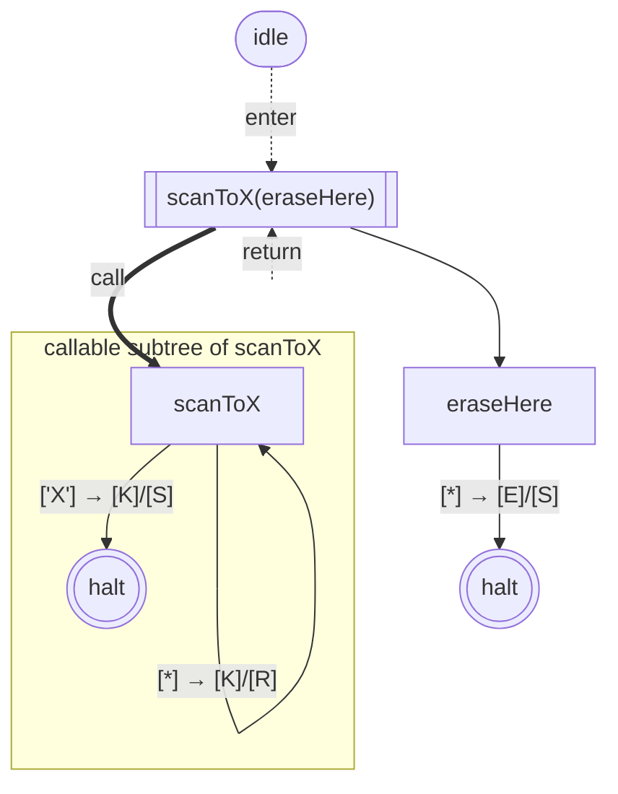
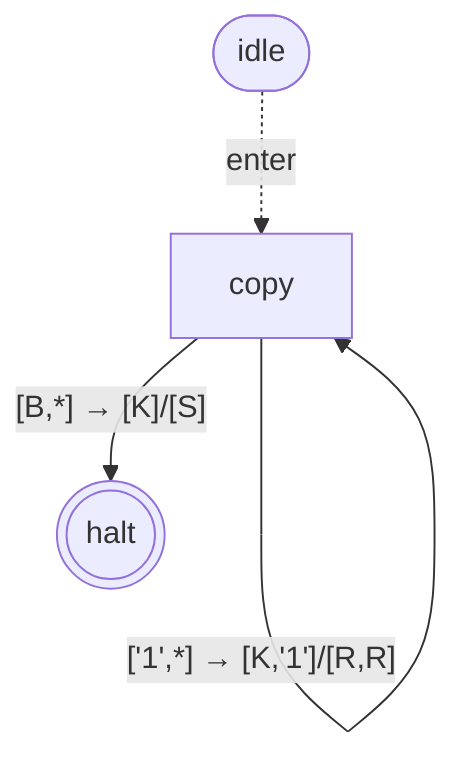

# @turing-machine-js/machine

[](https://github.com/mellonis/turing-machine-js/actions/workflows/main.yml)


A composable Turing-machine engine for JavaScript: multi-tape, subroutine composition via `withOverriddenHaltState`, Mermaid round-trip, and runtime breakpoints.

<details>
<summary>Table of contents</summary>

- [Install](#install)
- [Quick start](#quick-start)
- [Building from a state table](#building-from-a-state-table)
- [Classes](#classes) — [`Alphabet`](#alphabet) · [`Tape`](#tape) · [`TapeBlock`](#tapeblock) · [`TapeCommand`](#tapecommand) · [`Command`](#command) · [`State`](#state) · [`Reference`](#reference) · [`TuringMachine`](#turingmachine)
- [Subroutine composition with `withOverriddenHaltState`](#subroutine-composition-with-withoverriddenhaltstate)
- [State tags](#state-tags)
- [Debugging breakpoints](#debugging-breakpoints)
- [Special objects](#special-objects) — [`haltState`](#haltstate) · [`ifOtherSymbol`](#ifothersymbol) · [`movements`](#movements) · [`symbolCommands`](#symbolcommands)
- [Introspection and testing](#introspection-and-testing)
- [Diagram conventions](#diagram-conventions)
- [Versioning notes](#versioning-notes)
- [Libraries](#libraries)
- [Links](#links)

</details>


## Install

Using npm:

```sh
npm install @turing-machine-js/machine
```

## Quick start

Replace every `b` on the tape with `*`:

```javascript
import {
  Alphabet,
  State,
  Tape,
  TapeBlock,
  TuringMachine,
  haltState,
  ifOtherSymbol,
  movements,
} from '@turing-machine-js/machine';

const alphabet = new Alphabet([' ', 'a', 'b', 'c', '*']);
const tape = new Tape({ alphabet, symbols: ['a', 'b', 'c', 'b', 'a'] });
const tapeBlock = TapeBlock.fromTapes([tape]);
const machine = new TuringMachine({ tapeBlock });

await machine.run({
  initialState: new State({
    [tapeBlock.symbol(['b'])]: {
      command: [{ symbol: '*', movement: movements.right }],
    },
    [tapeBlock.symbol([alphabet.blankSymbol])]: {
      command: [{ movement: movements.left }],
      nextState: haltState,
    },
    [ifOtherSymbol]: {
      command: [{ movement: movements.right }],
    },
  }, 'replaceB'),
});

console.log(tape.symbols.join('').trim()); // a*c*a
```

The state graph for the example above (`toMermaid(toGraph(replaceB, tapeBlock))`):



Reading this specific diagram: `replaceB` (the rectangle) is the start state, marked by the dotted `enter` arrow from the `idle` sentinel. Three self-or-halt transitions: read `'b'` → write `'*'` and step right; read anything else (`*`) → keep, step right; read blank (`B`) → keep, step left, halt. Full notation reference — shapes, edge styles, label vocabulary — in [§Diagram conventions](#diagram-conventions).

A `State` is keyed by JS `Symbol`s returned from `tapeBlock.symbol(pattern)` — the pattern lists the expected symbol under each tape's head. Sentinels and constants used throughout: [`ifOtherSymbol`](#ifothersymbol) is the fallback key when nothing else matches; transitioning into [`haltState`](#haltstate) stops the run; [`movements`](#movements)`.{left,right,stay}` direct head moves; [`symbolCommands`](#symbolcommands)`.{keep,erase}` are write shortcuts. Full definitions in [§Special objects](#special-objects).

For multi-tape machines, pass one element per tape: `tapeBlock.symbol(['0', 'a'])` matches only when tape 1 is at `'0'` and tape 2 is at `'a'`. See the multi-tape example in [§Diagram conventions](#diagram-conventions) for what the rendered graph looks like.

## Building from a state table

If you prefer a textbook-style declarative API where every transition is one row of `(state, currentSymbol) → (nextState, nextSymbol, movement)`, you can build a small helper on top of the raw API. The whole thing fits in ~30 lines:

```javascript
import {
  Alphabet,
  Reference,
  State,
  TapeBlock,
  TuringMachine,
  haltState,
  ifOtherSymbol,
  movements,
  symbolCommands,
} from '@turing-machine-js/machine';

function buildFromTable({ alphabetString, initialState, finalStates, table }) {
  const alphabet = new Alphabet(alphabetString.split(''));
  const tapeBlock = TapeBlock.fromAlphabets([alphabet]);
  const movementOf = { L: movements.left, R: movements.right, S: movements.stay };

  // Pre-create a Reference per state name so transitions can point forward.
  const refs = Object.fromEntries(Object.keys(table).map((name) => [name, new Reference()]));
  const states = {};

  for (const [name, row] of Object.entries(table)) {
    const def = {};
    for (const [read, action] of Object.entries(row)) {
      const key = read === '*' ? ifOtherSymbol : tapeBlock.symbol([read]);
      def[key] = {
        command: {
          symbol: action.write ?? symbolCommands.keep,
          movement: movementOf[action.move ?? 'S'],
        },
        nextState: finalStates.includes(action.goto) ? haltState : refs[action.goto],
      };
    }
    states[name] = new State(def, name);
    refs[name].bind(states[name]);
  }

  return { tapeBlock, machine: new TuringMachine({ tapeBlock }), initialState: states[initialState] };
}

// Same "replace b with *" example as above, written declaratively:
const { tapeBlock, machine, initialState } = buildFromTable({
  alphabetString: ' abc*',
  initialState: 'scan',
  finalStates: ['HALT'],
  table: {
    scan: {
      'b': { write: '*', move: 'R', goto: 'scan' },
      ' ': {              move: 'L', goto: 'HALT' },
      '*': {              move: 'R', goto: 'scan' },  // '*' = ifOtherSymbol
    },
  },
});
```

This is what [`@turing-machine-js/builder`](../builder) provides as a separate package. Inline lets you tweak the format (multi-tape, OR-patterns, custom action shapes) freely; the builder package is more opinionated and limited to single-tape, single-symbol-per-row transitions.

## Classes

### Alphabet

The set of single-character symbols a tape can hold. The **first** symbol passed to the constructor is the blank — it fills any tape cell the head reaches before that cell has been written. At least two unique single-character symbols are required.

```javascript
const alphabet = new Alphabet([' ', '0', '1']);
alphabet.blankSymbol;   // ' '
alphabet.symbols;       // [' ', '0', '1']
alphabet.has('0');      // true
alphabet.index('1');    // 2
```

### Tape

An infinite-in-both-directions sequence of cells over an `Alphabet`, plus a head position. Cells the head moves into that haven't been written are blank.

```javascript
const tape = new Tape({ alphabet, symbols: ['a', 'b', 'c'], position: 0 });
tape.symbol;        // 'a' (cell under head)
tape.right();       // move head right; auto-extends with blanks at the edge
tape.symbol = 'X';  // write the cell under head
```

For visualization-friendly UIs, `Tape` exposes a fixed-width viewport centered on the head:

```javascript
const tape = new Tape({ alphabet, symbols: ['a', 'b', 'c'], viewportWidth: 7 });
tape.viewport;       // 7-cell snapshot centered on the head, padded with blanks
tape.viewportWidth;  // 7 (the constructor bumps even values to the next odd)
```

`viewportWidth` defaults to `1` and must be ≥ 1; `tape.viewport` always has exactly `viewportWidth` cells regardless of how many symbols the tape actually holds. Useful for rendering a sliding window in a UI; ignore if you only need `tape.symbols` / `tape.position`.

### TapeBlock

A bundle of one or more `Tape`s that the machine reads/writes together in lock-step. Construct via either factory:

```javascript
TapeBlock.fromAlphabets([alphabetA, alphabetB]);  // creates fresh blank tapes
TapeBlock.fromTapes([tape1, tape2]);              // reuses existing tapes
```

The key method is **`tapeBlock.symbol(pattern)`**: it returns an interned JS `Symbol` that simultaneously serves as a `State`'s transition key *and* matches the current configuration across all tapes. The pattern is one alphabet character per tape; pass several patterns by concatenating to express alternatives.

```javascript
tapeBlock.symbol(['^']);                  // single tape: matches '^'
tapeBlock.symbol(['^', '0', '1', '$']);   // single tape: matches any of '^', '0', '1', '$'
tapeBlock.symbol(['0', 'a']);             // 2 tapes: matches when tape 1 is '0' AND tape 2 is 'a'
```

### TapeCommand

A single-tape instruction the machine applies in one step: optionally write a symbol, optionally move the head. Defaults to *keep current symbol, do not move*.

```javascript
const cmds = [
  { symbol: '0', movement: movements.right },     // write '0' and move right
  { movement: movements.left },                   // keep current symbol, move left
  { symbol: symbolCommands.erase },               // write the blank, stay
  {},                                             // no-op
];
```

You'll rarely construct `TapeCommand` instances yourself — pass plain objects in your `State` definitions and they're wrapped automatically.

### Command

A bundle of `TapeCommand`s, one per tape in the `TapeBlock`. Like `TapeCommand`, you usually pass a plain array in the `State` definition rather than constructing `Command` directly.

### State

A node in the transition graph. Construct with a definition object whose keys are JS `Symbol`s from `tapeBlock.symbol(...)` (or `ifOtherSymbol` for the catch-all). Each value is `{ command, nextState }`.

```javascript
const s = new State({
  [tapeBlock.symbol(['1'])]: { command: { symbol: '0', movement: movements.right } },
  [tapeBlock.symbol(['$'])]: { command: { movement: movements.left }, nextState: haltState },
}, 'name');
```

Notable members and statics:

- **`state.id`**, **`state.name`** — identity (`isHalt` is `id === 0`).
- **`state.withOverriddenHaltState(other)`** — returns a copy whose would-be halt transitions fall through to `other`. The subroutine-call composition mechanism (see `library-binary-numbers/src/index.ts` for examples).
- **`State.toGraph(state, tapeBlock)`** — walks the reachable graph from `state` and returns a serializable `Graph` (states, transitions, alphabets).
- **`State.fromGraph(graph)`** — inverse of `toGraph`: rebuilds `State` instances + a fresh `TapeBlock` from a `Graph`. Round-trips together with `toMermaid` / `fromMermaid`.
- **`State.collectStates(state, tapeBlock)`** — walks the same graph and returns a `Map<number, {state, transitionSymbols}>` keyed by `GraphNode.id`. Use when downstream tooling holds a numeric id (e.g. a clicked node in a rendered graph) and needs the live `State` instance or the per-pattern `Symbol` for breakpoint setup. See [Setting breakpoints by graph id](#setting-breakpoints-by-graph-id).

For visualization, pair `State.toGraph` with `toMermaid` to render the graph in any Mermaid-aware viewer (GitHub, VS Code, mermaid.live):

```javascript
import { State, toMermaid } from '@turing-machine-js/machine';

const graph = State.toGraph(s, tapeBlock);
console.log(toMermaid(graph));
```

The string `toMermaid` produces is a real Mermaid flowchart that renders in-place anywhere Mermaid is supported:



*Edge labels are `read → write/move`. Write commands: `K` = keep (no write), `E` = erase (write the blank). Literal alphabet symbols are quoted (`'1'`, `'$'`). Movements: `L` (left), `R` (right), `S` (stay).*

> 💡 **Mermaid renders at most one edge per source/target pair.** If a state has two distinct transitions back to itself (or two parallel transitions to the same target), only one shows in the diagram. The string output is correct — this is a viewer-side limitation. For graphs with multiple parallel edges, paste the `toMermaid` output into [mermaid.live](https://mermaid.live) and switch to the `stateDiagram-v2` renderer, or post-process the output to your preferred format.

`fromMermaid` parses the same format back into a `Graph`. The round-trip is **behaviorally** lossless — the rebuilt graph runs to the same outputs on the same inputs (tested in `test/round-trip.spec.ts` for the binary-numbers libraries). Under the v7 callable-subtree emit (#174), bytewise stability holds across rebuilds even for shared-bare cases (modulo state-id renumbering, which the test normalizes). The composite name is not stored as any graph node's label — `fromGraph` recomputes it fresh on reconstruction — so the accumulation problem from #138 cannot reoccur.

### Reference

A forward-declaration handle, used when a `State` needs to point at another `State` that doesn't exist yet (cyclic graphs). Construct unbound, pass as `nextState`, call `.bind(actualState)` once that state has been built.

```javascript
const ref = new Reference();
const a = new State({ [symbol(['x'])]: { nextState: ref } }, 'a');
const b = new State({ [symbol(['y'])]: { nextState: a  } }, 'b');
ref.bind(b);   // a's transition now resolves to b at run time
```

The resulting cycle (`toMermaid(toGraph(a, tapeBlock))`):



`idle -. enter .->` points at the initial state passed to `toGraph` (`a` here); `b` is reachable from `a` via the bound `Reference`.

`reference.ref` returns the bound state and throws if the reference is still unbound when the machine runs. `bind()` is sticky — the first call wins; subsequent calls are silent no-ops that return the existing binding.

### TuringMachine

The runtime. Owns one `TapeBlock` and drives a state graph until it reaches `haltState`.

```javascript
const machine = new TuringMachine({ tapeBlock });

// Run to halt — `run()` returns a Promise<void>:
await machine.run({ initialState, stepsLimit: 1e5 });

// Or step-by-step (useful for visualization / debugging):
for (const step of machine.runStepByStep({ initialState })) {
  console.log(step.state.name, step.currentSymbols, '→', step.nextSymbols, step.movements);
}
```

Each yielded `step` (`MachineState`) has these fields:

| Field | Type | Meaning |
|---|---|---|
| `step` | `number` | 1-indexed iteration number |
| `state` | `State` | the state about to execute |
| `currentSymbols` | `string[]` | per-tape head symbols, before the command applies |
| `nextSymbols` | `string[]` | per-tape symbols that will be written |
| `movements` | `symbol[]` | per-tape head moves (`movements.left/right/stay`) |
| `nextState` | `State` | the state that will execute next |
| `debugBreak?` | `{ before?: true, after?: true }` | only set when `state.debug` matched on this iter — see *Debugging breakpoints* below |
| `matchedTransition` | `{ id: string, matchKinds: ('wildcard'\|'literal')[] }` | the transition the engine picked for this iter — see *Matched transition* below |

`stepsLimit` (default `1e5`) guards against runaway loops — exceeding it throws.

#### Choosing between `run()` and `runStepByStep()`

Both APIs are first-class — `run()` is built on top of `runStepByStep()` (see [TuringMachine.ts](src/classes/TuringMachine.ts)), and both stay supported. They model different consumer needs:

| | `run()` | `runStepByStep()` |
|---|---|---|
| Shape | async, returns `Promise<void>` | synchronous generator |
| Iteration timing | owned by the engine | owned by the consumer (`.next()` per step) |
| Lifecycle hooks | dispatches `onStep`, `onPause` (gated by the `debug` master switch) | none — yields raw `MachineState` |
| How `state.debug` reaches the consumer | the `onPause` callback (when `debug: true`) | the optional `debugBreak` field on each yield (always populated; consumer decides what to do) |
| Best for | run-to-halt with optional breakpoint UI; anything wanting the v6 per-iter `before → step → after` callbacks | synchronous test harnesses, visualizers that need tight control over step timing, custom batching |

**Rule of thumb.** If your consumer reads `state.debug` and expects the engine to act on it (pause, fire callbacks), use `run()`. If you want pull-based iteration with full control over timing, use `runStepByStep()` — the `debugBreak` field is still on every yield, so you can inspect breakpoint metadata yourself.

**Don't split one logical flow across both APIs.** A consumer that wants stepwise UI *and* hook-driven breakpoints should use `run({ onStep, onPause, debug })` exclusively. Routing some operations through `runStepByStep()` and others through `run()` means `state.debug` only flows through one of the two paths — a subtle footgun where breakpoints silently disappear on whichever code path uses the generator directly. For per-iter throttle / "wait between steps" UIs, see [Throttle pattern](#throttle-pattern).

### Matched transition

Every yielded `MachineState` carries a `matchedTransition` describing which transition the engine picked for that iter. The engine already resolves this via `state.getNextState(symbol)` internally; this field exposes the resolution to consumers so visualizations, log formatters, and coverage maps don't have to re-derive an ambiguous `(source, nextState)` pair (which collides when multiple transitions on the same source share a destination) or parse pattern strings from `toGraph`.

```ts
matchedTransition: {
  id: string;                               // resolvable in toGraph
  matchKinds: ('wildcard' | 'literal')[];   // per-tape, length = tape count
}
```

- **`id`** — `${stateId}.${transitionIx}`. Resolvable in `toGraph`'s output: `graph.nodes[stateId].transitions` has an entry with the matching `id`. For wrapper-entry iters (source is a wrapper produced by `withOverriddenHaltState`), `id` references the **bare's** transition — the wrapper's own `transitions` array in `toGraph` is empty because wrappers delegate, and the pattern actually lives on the bare. Detect by comparing `id.split('.')[0]` against `state.id`: different → wrapper delegation.

- **`matchKinds`** — per-tape match kind for the matched alternative's selector at each tape position. `'wildcard'` if the position held `ifOtherSymbol` (catch-all) in the winning alternative; `'literal'` if it held a specific symbol or symbol-list. Length always equals tape count.

Example use:

```javascript
await machine.run({
  initialState,
  onStep: (m) => {
    const wildcardPositions = m.matchedTransition.matchKinds  // per-tape, e.g. ['wildcard', 'literal']
      .map((k, i) => k === 'wildcard' ? i : -1)
      .filter((i) => i >= 0);
    console.log(`step ${m.step}: fired transition ${m.matchedTransition.id} (wildcards at tapes: ${wildcardPositions.join(',') || 'none'})`);
  },
});
```

## Subroutine composition with `withOverriddenHaltState`

`state.withOverriddenHaltState(other)` returns a copy of `state` whose would-be halt transitions fall through to `other` at run time. The original is left untouched. This is the engine's only composition primitive — bigger machines are built by stacking smaller halt-on-completion subroutines.

```javascript
import { Alphabet, State, TapeBlock, TuringMachine, Tape, haltState, ifOtherSymbol, movements, symbolCommands } from '@turing-machine-js/machine';

const alphabet = new Alphabet([' ', 'a', 'b', 'X']);
const tapeBlock = TapeBlock.fromAlphabets([alphabet]);
const { symbol } = tapeBlock;

// Reusable subroutine 1: walk right until 'X', halt on it.
const scanToX = new State({
  [symbol(['X'])]: { nextState: haltState },
  [ifOtherSymbol]: { command: { movement: movements.right } },
}, 'scanToX');

// Reusable subroutine 2: erase the head cell, halt.
const eraseHere = new State({
  [ifOtherSymbol]: { command: { symbol: symbolCommands.erase }, nextState: haltState },
}, 'eraseHere');

// Compose: scan to X, then ERASE it. scanToX is unmodified.
const scanThenErase = scanToX.withOverriddenHaltState(eraseHere);

const tape = new Tape({ alphabet, symbols: ['a', 'b', 'X', 'b', 'a'] });
tapeBlock.replaceTape(tape);
await new TuringMachine({ tapeBlock }).run({ initialState: scanThenErase });

console.log(tape.symbols.join('')); // "ab ba" — the X at index 2 is gone, head landed there.
```

What changes between *running `scanToX` standalone* and *running the composed wrapper*:

`toMermaid(toGraph(scanToX, tapeBlock))` — the standalone subroutine:



`toMermaid(toGraph(scanThenErase, tapeBlock))` — the wrapped composition:



**Reading guide** — the v7 callable-subtree emit (introduced in [#174](https://github.com/mellonis/turing-machine-js/issues/174)) models `withOverriddenHaltState` as a function call: the wrapper is the call site, the bare's subtree is the callable body.

1. **`[[scanToX(eraseHere)]]` (Mermaid subroutine / double-walled-rectangle shape)** is the wrapper node, drawn OUTSIDE any subgraph. It's the runtime entry point — `idle -. enter .->` arrives here — and shows the composite name (`bare(override)`). Wrappers have no transitions of their own; they delegate to the bare via the `call` arrow.
2. **`subgraph w_1["callable subtree of scanToX"]`** is the bare's callable subtree — the scope of code that runs when the wrapper is "called." It contains the bare `s1["scanToX"]`, any body states reachable from the bare, and a local halt marker `c1(((halt)))` where the bare's halt-bound transitions land.
3. **The bold `==> call`** from wrapper to bare is the call arrow — visual signature of "wrapper invokes this callable subtree, pushing its override onto the runtime stack." Bold arrows are reserved for wrapper-to-bare calls; counting them in a diagram counts the wrappers in play.
4. **The dotted `-. return .->`** from the subtree back to the wrapper is the return arrow — fires when the bare halts (lands on `c1`) and the stack pops. The wrapper's solid `--> s2` (to `eraseHere`) is the post-return continuation; ordinary transition under the function-call mental model.
5. **Real `(((halt)))` outside any subgraph** (`s0`) is the actual run terminus. Reached only by states OUTSIDE any callable subtree — here, by `eraseHere` after it erases the cell.

**Reading runtime sequence on tape `['a','b','X','b','a']`:** enter at wrapper `[[scanToX(eraseHere)]]` (with `eraseHere` queued as the override); `call` into the subtree of `scanToX`; `[*] → [K]/[R]` self-loops on `s1` until the head sees `X`; the `['X'] → [K]/[S]` edge lands on `c1`; `return` to the wrapper; solid `--> s2` to `eraseHere`; `eraseHere` runs `[*] → [E]/[S]` and halts at real `s0`. Run terminates.

> 💡 **Round-trip stability.** `toMermaid → fromMermaid → toGraph → toMermaid` is bytewise stable for wrapped states ([#139](https://github.com/mellonis/turing-machine-js/issues/139) regression). The callable-subtree emit (#174) eliminates per-context duplication: shared bares like `library-binary-numbers`'s `invertNumber` (used by two wrappers in `minusOne`) render as a single subtree with two `& `-joined call arrows — so even shared-bare cases now produce stable, dedup'd round-trips.

Wrappers nest: `inner.withOverriddenHaltState(middle).withOverriddenHaltState(outer)` chains halt-redirects through `middle → outer → halt`. `library-binary-numbers/src/index.ts`'s `minusOne` (the `~(~x + 1)` composition) uses a 4-deep nest of wrappers.

## State tags

A State carries an optional set of string tags — out-of-band metadata for visualization grouping and debugger labels. Tags don't affect runtime transition lookup, `equivalentOn` comparisons, or any structural identity; they ride alongside the State.

```ts
const s = new State({...}, 'walkToBlank::1')
  .tag('hot', 'subroutine-entry');

s.tags; // readonly ['hot', 'subroutine-entry'] — frozen snapshot
s.untag('hot');
s.tags; // readonly ['subroutine-entry']
```

**Scoped to the wrapper instance.** Under [`withOverriddenHaltState` memoization (#175)](https://github.com/mellonis/turing-machine-js/issues/175), `A.wohs(t1)` and `A.wohs(t2)` are distinct wrapper instances even though they share `A`'s `#symbolToDataMap`. Tags live on the instance, so tagging one wrapper doesn't propagate to siblings sharing the same bare. Wrappers from `withOverriddenHaltState` start with an empty tag set (do not inherit from bare); the caller tags explicitly as needed.

**Round-trip preserved.** `state.toGraph` writes the tag set to `GraphNode.tags`; `state.fromGraph` reads it back and reapplies. `toMermaid` renders tags two ways: inline in the node label (`sN["name<br>tag1, tag2"]`, universal Mermaid line break) and as `classDef tag_<sanitized>` + `class sN tag_<sanitized>` lines for color grouping. `fromMermaid` splits the label on `<br>` as source of truth; the `class` lines are decorative and discarded on parse.

See [§Diagram conventions § Tags](#tags) for the full emit shape.

## Debugging breakpoints

Any `State` can carry a runtime-mutable `debug` config that pauses execution at chosen points.

```ts
import { State, haltState, ifOtherSymbol } from '@turing-machine-js/machine';

const myState = new State({...});

// state.debug is always a DebugConfig instance — chained writes work
// without prior whole-object assignment:
myState.debug.before = true;
myState.debug.after = [symA];

// Whole-object assignment also works for one-shot setup:
myState.debug = { before: true };
myState.debug = { before: [symA] };
myState.debug = { before: [symA], after: [symA] };

// Pause when the engine is about to enter halt (program exit OR subroutine pop).
// haltState.debug is a `boolean` (#207) — halt is terminal, so there's only
// one meaningful pause moment (post-triggering-iter, before halt processing).
haltState.debug = true;
haltState.debug = false;        // turn off
haltState.debug = null;         // alias of false (reset)

// Reset filters later on a regular state — next read returns a fresh empty DebugConfig:
myState.debug = null;
```

> ⚠️ **`haltState.debug` is `boolean`-only.** Any object-shaped write (`{ before: true }`, `{ after: true }`, `{ before: true, after: true }`) throws at write time. The pause fires on the AFTER side of the iter whose transition leads to halt — `m.state` is the triggering state (not haltState), `m.debugBreak.after === true`. Diagram + log narratives read naturally: the halt-bound transition has already fired when the pause lands, and halt is the next thing.

The `debug` field is mutable — toggle breakpoints at runtime without rebuilding the graph. The internal cell is shared with `state.withOverriddenHaltState(...)` wrappers, so an assignment on the original is visible from every wrapper. `state.debug` is always a `DebugConfig` instance (lazy-initialized on first read); plain-object input (`state.debug = { before: true }`) is wrapped in a fresh `DebugConfig` automatically. The instance itself is `Object.seal`-ed — typos like `state.debug.bofore = true` throw `TypeError` instead of silently creating a useless property. Per-property setters validate and freeze the stored array, so `state.debug.before.push(...)` also throws `TypeError`.

`run()` is async and accepts an `onPause` hook:

```ts
await machine.run({
  initialState,
  onStep: (m) => { /* logger sees every step */ },
  onPause: async (m) => {
    // Awaited at every break — hold execution until you resolve.
    if (m.debugBreak?.before) console.log('before:', m.state.name);
    if (m.debugBreak?.after)  console.log('after:',  m.state.name);
  },
});
```

Both `before` and `after` for the same iteration fire on the iteration's own yield, in the order **before → step → after**. `m.state` is always the iteration's own state; the `m.debugBreak` flag (`{before: true}` or `{after: true}`) tells the consumer which timing fired.

If `onPause` is not provided, breaks fire-and-resume invisibly — the trajectory is identical to running without `debug` set.

**Filter semantics:** `true` is a wildcard (match any symbol). `[ifOtherSymbol]` is NOT a wildcard — it matches only the catch-all resolution case (same meaning as in transition keys).

**Caveat:** `haltState` is a module-level singleton. Setting `haltState.debug` affects every machine in the process; clear in `afterEach` / `finally` for test isolation.

### Setting breakpoints by graph id

Downstream UIs (graph renderers, debugger panels) often have only a numeric `GraphNode.id` — the user clicked a state node, or a transition edge in a rendered SVG. `State.collectStates(initial, tapeBlock)` returns a `Map` keyed by that numeric id, with the live `State` instance and the per-pattern `Symbol` array as its value:

```ts
import { State, ifOtherSymbol } from '@turing-machine-js/machine';

const stateMap = State.collectStates(initial, tapeBlock);

// Toggle a state-level breakpoint by id (any pattern triggers).
const entry = stateMap.get(clickedStateId);
if (entry) {
  entry.state.debug.before = true;
}

// Per-pattern breakpoint by GraphTransition.id — the contract is
// positional: `transitionSymbols[K]` is the Symbol that the
// `${stateId}-${K}` GraphTransition fires on.
const [n, k] = clickedEdgeId.split('-').map(Number);
const e = stateMap.get(n);
const sym = e?.transitionSymbols[k];
if (e && sym) {
  e.state.debug.before = [sym];
}
```

**Coverage rules:** regular / bare states get the full `[...#symbolToDataMap.keys()]` including `ifOtherSymbol` at its natural slot; wrappers and the halt singleton get empty `transitionSymbols`; synthetic halt markers (Graph nodes with `id = -frameId`, one per callable-subtree frame) are excluded from the map. See `State.collectStates` JSDoc for the full contract.

> ⚠️ `stateMap.get(0)!.state === haltState` — the entry at id `0` is the process-wide halt singleton. Toggling its `debug` affects every machine in the runtime, same caveat as direct `haltState.debug` writes.

### Throttle pattern

For per-iter throttle / animation / "wait between steps" UIs, use the **`onIter`** hook — an awaited callback that fires once at the end of every iter, after both `onPause` dispatches on the same yield. It's the engine-native shape for per-iter coordination:

```ts
await machine.run({
  initialState,
  onIter: async (m) => {
    // Fires after before(m.state) / step / after(m.state) on iter m.step.
    await new Promise((r) => setTimeout(r, intervalMs));
  },
});
```

`onIter` is unaffected by the `debug` master switch and unrelated to `state.debug` — it fires on every iter regardless of whether any breakpoints are armed. It coexists cleanly with user-authored `state.debug` breakpoints: on an iter with both `.before` and `.after` armed, the consumer sees `onPause(before)` → `onStep` → `onPause(after)` → `onIter`, in that order, on the same yield.

A few details:

- **Halting iter**: `onIter` still fires on the iter whose `m.nextState === haltState`, after any halt-time `onPause` dispatches. Engine returns cleanly after that. Use this to land "halted" UI state in interactive consumers.
- **Click-pause / external interruption**: keep a flag set from the outside; check it inside `onIter` and `await` a resolvable Promise the UI controls (instead of the bare `setTimeout`). The engine just sees a longer awaited `onIter` — no engine surface needed for the pause.
- **Sync consumers should keep using `onStep`**: it's microtask-free; `onIter` adds one awaited boundary per iter. Use the right hook for the right verb (logging/tracing → `onStep`, throttle/coordination → `onIter`, user breakpoints → `onPause`).

(History: v6.2.0 briefly widened `onStep` to `void | Promise<void>` and added an inline `await`, motivated by this same throttle use case. That was a mistake — restored to sync in v6.3.0. v6.3.0 documented a workaround using `onPause` self-rearm on `state.debug.after = true`; that workaround is superseded by `onIter` in v6.4.0+.)

## Special objects

### haltState

A singleton `State` (`id === 0`). Transitioning into it stops the run. Imported as a named export from `@turing-machine-js/machine`; do not construct your own — `state.isHalt` checks identity against this single instance.

### ifOtherSymbol

A sentinel `Symbol` used as a key in a `State` definition to mean *match any symbol not handled by the other keys* (the fallback transition).

### movements

Per-tape head movement directives passed in `TapeCommand.movement`:

* `movements.left` — move the head one cell left
* `movements.right` — move the head one cell right
* `movements.stay` — leave the head where it is

### symbolCommands

Special values for `TapeCommand.symbol`:

* `symbolCommands.keep` — leave the current cell unchanged (default)
* `symbolCommands.erase` — write the alphabet's blank symbol

## Introspection and testing

`@turing-machine-js/machine` ships two complementary runtime utilities:

**`summarize` / `summarizeGraph`** — *structural* analysis. Looks at the state graph without running it.

```javascript
import { summarize } from '@turing-machine-js/machine';

const stats = summarize(myState, myTapeBlock);
// {
//   stateCount, transitionCount,
//   compositionEdgeCount, maxCompositionDepth,
//   selfLoopCount, hasCycles,
//   tapeCount, alphabetCardinalities,
// }
```

`State.inspect(state)` returns the same kind of data for a single state (transitions, override-halt target, etc.) without traversing the graph.

**`equivalentOn`** — *behavioral* comparison. Runs two machines on a list of test inputs and reports whether their outputs agree, where they first diverge, and how many steps each took.

```javascript
import { equivalentOn } from '@turing-machine-js/machine';

const report = equivalentOn(
  { state: referenceState, getTapeBlock: () => referenceTapeBlock.clone() },
  { state: candidateState, getTapeBlock: () => candidateTapeBlock.clone() },
  ['^1$', '^10$', '^11$', '^111$'],   // test cases
);
// report.allAgree → true | false
// report.results[i] → { agree, referenceOutput, candidateOutput,
//                       referenceSteps, candidateSteps, firstDivergenceStep }
```

For different alphabets, pass `{ reference, candidate }` paired cases plus a custom output comparator. See [`packages/machine/src/utilities/equivalence.spec.ts`](src/utilities/equivalence.spec.ts) for worked examples.

Together: use `summarize` to ask "is this machine the right shape?" (size, composition, cycles), and `equivalentOn` to ask "does this machine compute the right thing?" (correctness against a reference). Useful when comparing two implementations of the same algorithm — e.g., the marker-based and bare binary libraries — or when grading student-written machines against a reference.

For visualization and round-tripping, see `State.toGraph` / `State.fromGraph` and `toMermaid` / `fromMermaid`.

## Diagram conventions

The full reference for reading `toMermaid` output — shapes, edge styles, and the bracketed edge-label vocabulary. All shapes and arrows are standard [Mermaid flowchart syntax](https://mermaid.js.org/syntax/flowchart.html); any Mermaid renderer (GitHub preview, IDE plugins, [mermaid-js](https://github.com/mermaid-js/mermaid) client-side) paints these diagrams the same way.

### Node shapes

| Shape | Meaning |
|---|---|
| `s0(((halt)))` | the halt state |
| `sN["name"]` | a regular state (or a bare, when inside a subgraph) |
| `sN[["composite-name"]]` | a `withOverriddenHaltState` wrapper (call site, outside any subgraph) — see [§Subroutine composition](#subroutine-composition-with-withoverriddenhaltstate) |
| `cN(((halt)))` inside a subgraph | halt marker (visualization aid; maps back to the singleton `haltState` at runtime) |
| `idle([idle])` | pre-execution sentinel (not a real state) |

### Edge styles

| Style | Where | Meaning |
|---|---|---|
| `-->` regular solid | between states; wrapper → override | plain transition / wrapper's post-return continuation |
| `==> "call"` thick solid | wrapper → bare | the wrapper's call into its callable subtree; reserved for wrapper-to-bare |
| `w_N -. "return" .->` dotted | subtree → wrapper | the subtree's halt-marker has incoming → control returns to the calling wrapper |
| `w_N -. "halt" .->` dotted | subtree → `s0` | the subtree has a non-wrapper entry path → halt-marker can fire with empty stack (real halt) |
| `idle -. enter .->` dotted | from `idle` to initial state | execution-start marker |

The `&` ribbon syntax (`s_W1 & s_W2 == "call" ==> s_A`) collapses multiple wrappers that share a bare into one arrow. Bold `==>` is reserved exclusively for the wrapper-to-bare `call` arrow.

### Groupings

`subgraph w_N["callable subtree of NAME"] … end` wraps a bare + its body + a halt marker — the callable scope of code that runs when a wrapper "calls" the bare. Multi-bare frames (union-find merged from shared body states) use the label `"callable scope: A ∪ B"`.

### Tags

Tagged states (via `state.tag('hot', 'sampled')` — see [§State tags](#state-tags)) render two ways simultaneously:

- **Inline in the node label**: `sN["name<br>tag1, tag2"]` — the `<br>` is Mermaid's universal line break, so the tags display as a second line under the state name in any renderer.
- **As a color class**: `classDef tag_<sanitized> fill:#...,stroke:#...` per unique tag (6-color palette selected by tag-name hash), plus `class sN,sM tag_<sanitized>` listing all nodes carrying the tag. Lets the eye group related states by color even when their names are scattered across the diagram.

The `<br>`-embedded label is the source of truth for `fromMermaid` round-trip; the `classDef`/`class` lines are decorative and regenerate on the next `toMermaid` emit. Tag-name sanitization in `classDef` identifiers: any char outside `[A-Za-z0-9_-]` is replaced with `_`. Labels preserve the raw tag names.

### Edge label format

`[reads] → [writes]/[moves]`. Each bracketed list is a tape-block reading — one entry per tape; brackets always present, even single-tape.

| Glyph | Where | Meaning |
|---|---|---|
| `'X'` | read, write | literal alphabet symbol (single-quoted) |
| `*` | read only | `ifOtherSymbol` catch-all (ASCII `*`; a literal `*` in the alphabet renders as the quoted `'*'`, so the marker stays unambiguous) |
| `B` | read only | the tape's blank symbol (a literal `B` in the alphabet appears as `'B'`, so the marker stays unambiguous) |
| `K` | write only | keep (no write) |
| `E` | write only | erase (write the tape's blank) |
| `L` / `R` / `S` | move only | left / right / stay |

### Alternation rule

Alternative read patterns are always per-pattern-bracket:

- Single-tape: `['^']|['1']|['0']`
- Multi-tape: `['0','a']|['1','b']` — "(tape 1=`'0'` AND tape 2=`'a'`) OR (tape 1=`'1'` AND tape 2=`'b'`)"

The compact in-bracket form `['^'|'1']` is **rejected** by `fromMermaid` — and never emitted by `toMermaid`. The reason is pedagogical: each alternative is its own drawn transition, and the compact form would read as cross-product semantics in multi-tape (`['0'|'1','a'|'b']` could mean 4 combinations rather than 2 paired alternatives). One consistent rule across tape counts: each alternative is a full bracketed pattern.

### Multi-tape example

A 2-tape "copier" machine — as long as tape 1 reads a non-blank, write the same symbol to tape 2 and step both right; halt when tape 1 reads blank:



Reading `['0',*] → [K,'0']/[R,R]`:

- **Read** `['0',*]` — tape 1 must be literal `'0'`; tape 2 is `ifOtherSymbol` (any).
- **Write** `[K,'0']` — tape 1: keep; tape 2: write literal `'0'`.
- **Move** `[R,R]` — both tapes step right.

## Versioning notes

API surface changes since v3, in past tense so the timing of each piece is explicit:

- **v4** — `run()` became async (`Promise<void>`). Per-state runtime breakpoints landed (`state.debug.before` / `state.debug.after`); `run()` accepted an `onDebugBreak` hook. `MachineState` exposed on each yield.
- **v5** — `onDebugBreak` renamed to `onPause`. New `run({ debug: boolean })` master switch suppresses all `onPause` dispatches without unsetting `state.debug` assignments. Assigning a truthy `.after` to `haltState.debug` now throws at write time (halt is terminal — no iteration-after-halt to anchor on). *Superseded in v7 by #207: `haltState.debug` is now `boolean`, all object-shaped writes throw.*
- **v6** — Per-iter lifecycle reordered to `before → step → after`, all firing on the same yield. Previously `after` fired on iter K+1's tick with a `prevYield` substitution dance; that substitution is gone. The `MachineState.debugBreak` field shape is unchanged across all three versions.
- **v6.1** — `state.debug` ergonomics: the field is now always a non-null `DebugConfig` instance (lazy-initialized on first read), so chained field writes like `state.debug.before = true` work on a fresh state without a prior whole-object assignment. The `DebugConfig` instance is `Object.seal`-ed, so typos like `state.debug.bofore = true` throw `TypeError` at write time instead of silently creating a useless property. `state.debug = null` continues to work but semantically means "reset filters" — the next read returns a fresh empty `DebugConfig` (#150).
- **v6.2** *(superseded by v6.3.0)* — widened `onStep`'s signature to `(m) => void | Promise<void>` and added an inline `await onStep(...)` in the run loop, enabling throttle-in-`onStep` patterns. This overturned the docstring-stated contract that `onStep` is sync (microtask-free); the right place for per-iter throttling is `onPause` with self-rearm (see [Throttle pattern](#throttle-pattern)). Restored in v6.3.0.
- **v6.3** — `onStep` reverted to its v6.0–v6.1 sync contract — `(m) => void`, called synchronously inside the run loop. The Throttle pattern section documents the engine-native shape for per-iter throttle / "wait between iters" UIs. No other API changes.
- **v6.4** — New **`onIter`** hook on `run()`: awaited, fires once at the end of every iter (after both `onPause` dispatches on the same yield), unaffected by the `debug` master switch. Use for per-iter throttle / animation / coordination needing a suspend point; complements the existing sync `onStep` (tracing) and conditional `onPause` (user breakpoints). Three-hook contract is now `onStep` (sync, mid-iter) / `onPause` (awaited, on `state.debug` match) / `onIter` (awaited, end-of-iter). Additive — peer-deps unchanged. The v6.3.0 README's `onPause`-rearm throttle workaround is superseded.
- **v7** *(latest alpha: alpha.4, 2026-05-23)* — Composition-representation overhaul + first-class state tags + id-keyed `State.collectStates` lookup. **Pre-release on the `next` dist-tag:** `npm install @turing-machine-js/machine@next` (or pin `@7.0.0-alpha.4`). Stable v7.0.0 still pending [#102](https://github.com/mellonis/turing-machine-js/issues/102) (debugger step-in/over/out primitives). Highlights across alphas:

  **alpha.4** — **`State.collectStates(initial, tapeBlock)`** ([#195](https://github.com/mellonis/turing-machine-js/issues/195)) returns a `Map<number, {state, transitionSymbols}>` keyed by `GraphNode.id` so downstream tooling can mutate `state.debug` by numeric id and set per-pattern breakpoints by `GraphTransition.id`. Graph serialization extracted to `utilities/stateGraph.ts` with a Symbol-keyed `@internal` accessor on `State` ([#180](https://github.com/mellonis/turing-machine-js/issues/180); no public-API change — the `State.toGraph` / `.fromGraph` statics remain as thin delegates). Two upstream fixes: `toMermaid` HTML-entity-escapes user content in labels so alphabets containing `"`, `<`, etc. parse correctly ([#194](https://github.com/mellonis/turing-machine-js/issues/194)); `runStepByStep`'s halt stack is now run-scoped, fixing a memory leak / ghost-iteration when the same `TuringMachine` instance is reused across calls ([#196](https://github.com/mellonis/turing-machine-js/issues/196)). See [§Setting breakpoints by graph id](#setting-breakpoints-by-graph-id).

  **alpha.3** — first-class **State tags** ([#186](https://github.com/mellonis/turing-machine-js/issues/186)). `state.tag(...) / .untag(...) / .tags` API; `GraphNode.tags: string[]` round-trips through `toGraph`/`fromGraph`; `toMermaid` emits tags two ways simultaneously — inline via `<br>` in node labels (`sN["name<br>tag1, tag2"]`) and as `classDef`/`class` for color grouping. Tags live on the State instance (not on the shared `#symbolToDataMap`), so engine [#175](https://github.com/mellonis/turing-machine-js/issues/175) memoization doesn't leak tags across wrappers sharing a bare. See [§State tags](#state-tags).

  **alpha.2** — callable-subtree `toMermaid` emit refinement ([#174](https://github.com/mellonis/turing-machine-js/issues/174)). The wrapper is a separate `[[composite-name]]` node OUTSIDE the subgraph; the bare's reachable subtree becomes a `subgraph w_${frameId}["callable subtree of NAME"]` block. Frames computed via union-find — shared bares dedupe with `&` ribbons on call arrows. Bold `==> "call"` reserved for wrapper-to-bare; dotted `-.->` for frame dispatch (`return` / `halt` / `enter`). Plus engine memoization ([#175](https://github.com/mellonis/turing-machine-js/issues/175)) and nested-chain collapse ([#176](https://github.com/mellonis/turing-machine-js/issues/176)) for `.wohs()`.

  **alpha.1** — initial v7 composition-representation overhaul:
  - **`withOverrodeHaltState` → `withOverriddenHaltState`** ([#149](https://github.com/mellonis/turing-machine-js/issues/149)). Grammar fix on a name introduced in 2019: the past-participle `overridden` fits the "with a halt-state that has been ___" naming idiom; `overrode` (simple past) didn't. Hard cutover — no deprecated alias. The getter (`state.overrodeHaltState` → `state.overriddenHaltState`) and the serialized `Graph` data field (`node.overrodeHaltStateId` → `node.overriddenHaltStateId`) rename in lockstep. Consumer migration: global find/replace `OverrodeHaltState` → `OverriddenHaltState` and `overrodeHaltState` → `overriddenHaltState`. Persisted `State.toGraph` JSON dumps would need the same field-rename treatment, but persistence isn't a known consumer pattern.
  - **Paren-based wrapped-state naming** ([#148](https://github.com/mellonis/turing-machine-js/issues/148)). `withOverriddenHaltState`'s composite name format changed from flat `bare>override` to nested `bare(override)`. Same nesting depth reads as `A(B(A))` (bare = `A`, override = `B(A)`) versus `A(B)(A)` (bare = `A(B)`, override = `A`) — two structurally-different wrap-trees that the old `>`-flat notation collided into the single string `A>B>A`. As a consequence, **user-provided state names must not contain `(` or `)`** — `State` now throws at construction time if a user passes such a name. The `>` character stays valid in user names (no longer reserved). The `inspect()` / `toGraph` / `toMermaid` outputs carry the new format. `states.md` files in `library-binary-numbers` regenerate accordingly.
  - **`toMermaid` callable-subtree emit** ([#174](https://github.com/mellonis/turing-machine-js/issues/174), supersedes the alpha.1 collapsed-bare shape from #138/#139). `withOverriddenHaltState` is modeled as a function call: the wrapper is a `[[composite-name]]` call site OUTSIDE any subgraph, the bare's reachable subtree becomes a `subgraph w_${frameId}["callable subtree of NAME"] … end` block containing the bare + body states + a per-frame halt marker `c${frameId}(((halt)))`. Frames are computed via union-find on bare-reachability — overlapping reach sets merge into a single union frame, so shared bares (`library-binary-numbers/minusOne`'s `invertNumber`) appear ONCE with `& `-joined call arrows from each wrapper. Bold `==> "call"` arrows are reserved for the wrapper-to-bare call; dotted `-.->` is reserved for frame-level dispatch (`return` / `halt` / `enter`). The retired `-. onHalt .->` keyword is replaced by a solid `--> override` arrow (just an ordinary transition under the call/return mental model). `GraphNode` gains `isWrapper`, `bareStateId`, `frameId` fields (and drops `isWrapped`). Bytewise round-trip stability now holds for all wrapped states including shared-bare cases (no per-context duplication).

For the full release history, see the [GitHub releases page](https://github.com/mellonis/turing-machine-js/releases).

## Libraries

- [@turing-machine-js/library-binary-numbers](https://github.com/mellonis/turing-machine-js/tree/master/packages/library-binary-numbers) — binary arithmetic with `^…$` markers, multi-number-per-tape support
- [@turing-machine-js/library-binary-numbers-bare](https://github.com/mellonis/turing-machine-js/tree/master/packages/library-binary-numbers-bare) — same operations on a 3-symbol alphabet, single-number-per-tape, much smaller state graphs

## Links

- [Turing Machine](https://en.wikipedia.org/wiki/Turing_machine) on Wikipedia
